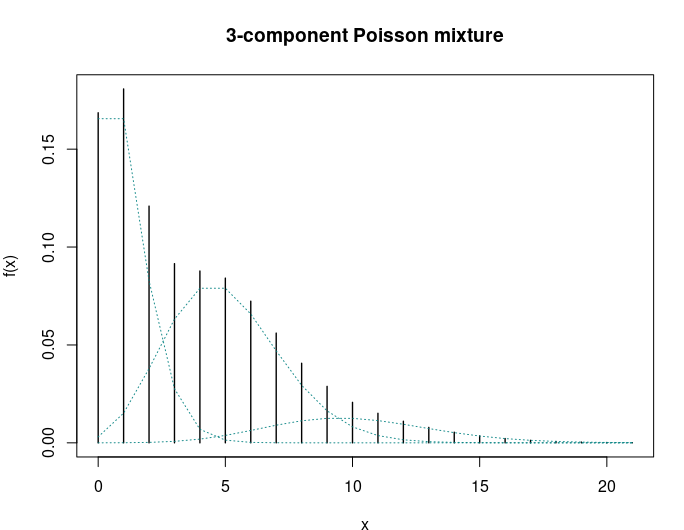
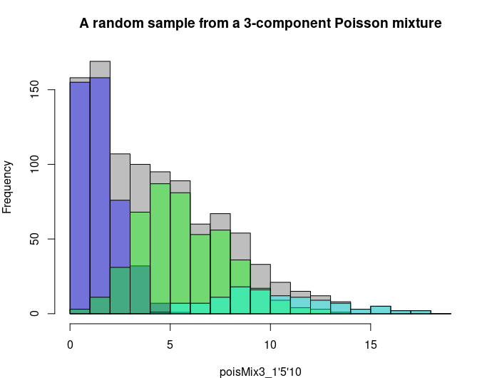
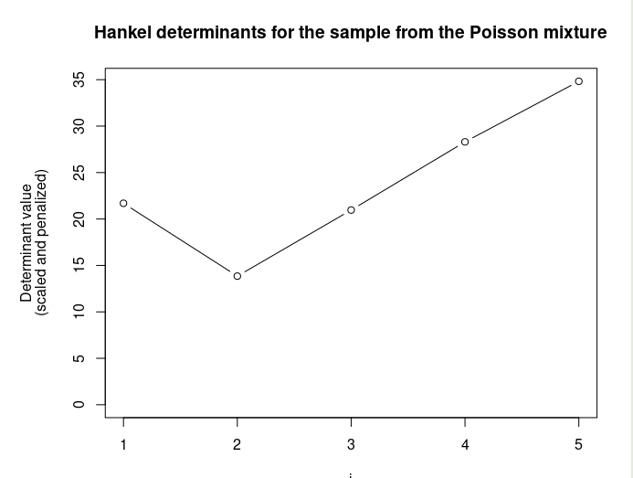
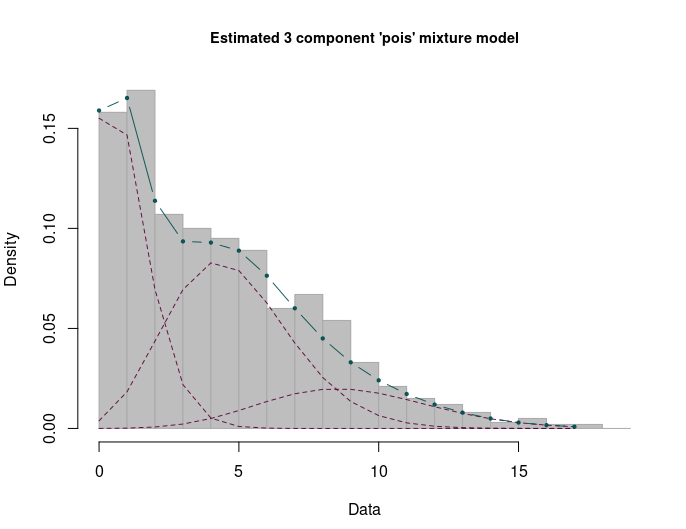

# Summary

Mixture models have been used extensively in statistical applications and have attracted much attention from theoretical and computational perspectives. The list of works on mixture models is extensive: [@Teicher63], [@LindsayI], [@LindsayII], [@Titterington], [@McLachlan], to name a few. 

The popularity of such models stems from the fact that they allow for modeling heterogeneous data whose distribution cannot be captured by a single parametric distribution. The (unknown) distribution is assumed to result from mixing over some latent parameter in the following sense: the latent parameter is viewed itself as a random variable drawn from some unknown mixing distribution. When this mixing distribution is only assumed to belong to the ensemble of all possible distribution functions, the mixture model is called *nonparametric* and estimation of the mixing distribution requires using some nonparametric estimation method, such as the nonparametric maximum likelihood estimator (NPMLE) whose fundamental properties were scrutinized in [@LindsayI], [@LindsayII]. One remarkable property of the NPMLE of the mixing distribution is that it is, under some conditions, a discrete distribution function with at most $k$ number of jumps, where $k$ is the number of distinct observations in the random sample drawn from the mixture. This allows for considering the smaller class of finite mixture models (characterized by a discrete mixing distribution with a finite number of jumps). In some very simple situations, the number of mixture components could be known in advance, in which case the model is *fully parametric* and convergence of classical estimators such as the parametric maximum likelihood estimator (MLE) occurs at the rate $\sqrt{n}$ (given certain conditions). Also, the well-known expectation-maximization (EM) algorithm [@Dempster] can be used to find the MLE of the unknown parameters. However, in many applications such knowledge is rarely available and the number of components has to be estimated from the data. The goal of **mixComp** is to estimate the unknown complexity using several methods . 

The **mixComp** package provides several methods known from the statistical literature for estimating the unknown complexity of a (univariate) finite mixture. The considered approaches can be loosely grouped into three categories:

  - methods built upon the determinants of the Hankel matrix of moments of the mixing distribution; 
  
  - methods based on penalized minimum distance between the unknown probability density and a consistent estimator thereof;
   
  - likelihood ratio test (LRT) - based techniques. 

These methods all come with theoretical guarantees for consistency. The performance of the methods varies according to the underlying mixture distribution and the sample size. While not the primary goal, most methods simultaneously estimate the component weights and parameters. 


# Statement of need

Two main features distinguish **mixComp** from other mixture-related **R** [@R] packages: 
- it is focused on the estimation of the complexity rather than the component weights and parameters (while these are often estimated as a by-product, all methods contained in **mixComp** are based on theory specifically developed to consistently estimate the number of components in the mixture); 
- it is applicable to parametric mixtures well beyond those whose component distributions are included in the **stats** package, making it more customizable than most packages for model-based clustering. 

The packages **mixtools** [see @mixtools] and **flexmix** [see @flexmix1; @flexmix2; @flexmix3] should both be mentioned at this point: aside from **mixtools**'s focus on mixture-of-regressions and non-parametric mixtures which are less relevant to this package, it is widely used to fit (multivariate) normal, multinomial or gamma mixtures with the EM algorithm, also containing routines for selecting the number of components based on information criteria and parametric bootstrapping of the LRT statistic values. However, they are limited to multinomial and normal mixtures as well as mixtures-of-regressions. While **flexmix** was developed to deal with mixtures-of-regression, it stands out from other packages by its extensibility, a design principle that we aimed for when creating **mixComp**. Other packages dealing with mixture models are **mclust** [@mclust], which fits mixtures of Gaussians using the EM algorithm, **MixSim** [@mixsim], which allows for simulation from mixtures and comparing the performance of clustering algorithms, and **mixdist** [@mixdist], used for grouped conditional data. 

**mixComp** can be used on virtually any parametric mixture as long as functions generating random variates and evaluating the density are provided for the component distribution. It is applicable to parametric mixtures well beyond those whose component distributions are included in the **R** package **stats**, making it more customizable than most packages for model-based clustering. The estimation results can be printed and plotted for further analysis. The package is aimed at practitioners studying phenomena that can be effectively modelled using mixture distributions. In particular, it can be used to identify settings and conditions, under which a certain method provides more accurate estimates than the others.


# Notation 

A distribution $F$ is called a *finite mixture* if its density (we write density throughout and keep in mind that it may be taken with respect to the Lebesgue or the counting measure) is of the form
$$f(x) = \sum_{i=1}^p w_i g_i(x),$$
where $p \in \mathbb{N}$ is the mixture complexity, $(w_1, \dots w_p : \sum_{i=1}^p w_i = 1$, $w_i \geq 0,$ for $i=1,\dots,p)$ are the component weights and the density $g_i(x)$ is the $i$-th component of the mixture. As the scope of **mixComp** is limited to mixtures where the family of the component distributions is known, we replace $g_i(x)$ by a parametric density $g(x; \theta_i)$ indexed by the (possibly multivariate, say $d$-dimensional) parameter $\theta_i$ in the parameter space $\Theta \subseteq \mathbb{R}^d$.

Given some complexity $j$, the two relevant parameter spaces can therefore be defined as
$$\Theta_j = \{\theta_1 \dots \theta_j: \theta_i \in \Theta \subseteq \mathbb{R}^d, \text{ for } i = 1,\dots,j\}$$
and
$$W_j = \{w_1, \dots, w_j: \sum_{i=1}^j w_i = 1, w_i \geq 0, \text{ for } i = 1,\dots,j\}.$$

We assume that the family of the component densities $\{g(x; \theta):\theta \in \Theta\}$ is known, but the component parameters $\textbf{\theta}= (\theta_1, \dots, \theta_p) \in \Theta_p$, the component weights $\textbf{w} = (w_1, \dots, w_p) \in W_p$ and the mixture complexity $p \in \mathbb{N}$ are unknown. Suppose now that $F$ is a finite mixture distribution with density $f(x) = \sum_{i=1}^p w_i g(x; \theta_i)$ and $\textbf{X} = \{X_1, \dots, X_n\}$ is an i.i.d. sample of size $n$ from $F$. **mixComp** selects the smallest such $p$, either on its own or by simultaneously estimating the weights $w_i$ and the component parameters $\theta_i$, $i \in 1, \dots, p$.


# 1. Functions using Hankel matrices

$p$ is characterized by the smallest integer $j$ such that the determinant of the $(j+1) \times (j+1)$ Hankel matrix of the first $2j$ moments of the mixing distribution equals 0. It can be shown that this determinant is 0 for all $j \geq p$. Formally, for any vector $\mathbf{c} = (c_0, \dots, c_{2k}) \in \mathbb{R}^{2k+1}$ with $c_0 = 1$, the Hankel matrix of $\mathbf{c}$ is defined as the $(k+1)\times(k+1)$ matrix:
$$H(\mathbf{c})_{i,j} = c_{i+j-2}, \quad \quad 1 \leq i,j \leq k+1.$$

Let $\textbf{c}^{2j+1} \in \mathbb{R}^{2j+1}$ be the vector containing the first $2j+1$ (raw) moments of the mixing distribution. For finite mixture models, this amounts to
$$c^{2j+1}_k = \sum_{i=1}^p w_i \theta^k_i, \quad \text{ for } k \in \{0,\dots, 2j\} \text{ and } \theta_i \in \mathbb{R}, i \in \{1,\dots,p\}.$$

Then, for all $j \geq 1$, $H(\textbf{c}^{2j+1})$ is non-negative and
$$ p = \min\{j \geq 1 : \det H(\textbf{c}^{2j+1}) = 0\}. $$

Making use of this fact, the first approach to estimating the order of a mixture that is implemented in **mixComp** relies on initially finding a consistent estimator of $\textbf{c}^{2j+1}$ based on $\textbf{X}$, say $\hat{\textbf{c}}^{2j+1}$, to then iteratively calculate the applicable Hankel matrix while increasing the assumed order $j$ until a sufficiently small value of $\det H(\hat{\textbf{c}}^{2j+1})$ is attained. However, since $\det H(\hat{\textbf{c}}^{2j+1})$ should be close to 0 for all $j \geq p$, this would lead to choosing $\hat{p}$ rather larger than the true value. Therefore [@hankel] define the empirical penalized objective function as
$$J_n(j) := \lvert \det H(\hat{\textbf{c}}^{2j+1}) \rvert + A(j)l(n),$$
with $l(n)$ being a positive function converging to $0$ as $n\to\infty$ and $A(j)$ being positive and strictly increasing. 

$$\hat{p} := \text{argmin}_{j \in \mathbb{N}} J_n(j)$$
is then a consistent estimator of $p$.

As an extension to simply adding a penalty term to the determinant, a scaling approach was considered by [@lilian]. Let $\hat{d}_j = \det H(\hat{\textbf{c}}^{2j+1})$, $d_j = \det H(\textbf{c}^{2j+1})$ and $j_m \geq p, j_m \in \mathbb{N}$. Since the estimated moments $\hat{\textbf{c}}^{2j+1}$ are asymptotically normal, one can apply the delta method:
$$
\sqrt{n} \cdot
  \big(
    \hat{d}_1-d_1,
    \dots,
    \hat{d}_{p-1}-d_{p-1},
    \hat{d}_p-0,
    \dots,
    \hat{d}_{j_m}-0
  \big)^\top \quad \overset{\mathcal{D}}{\longrightarrow} \quad \mathcal{N}(0_{j_m \times 1}, \Sigma_ {j_m \times j_m}).
$$

Instead of inspecting the vector $(\hat{d}_1, \dots, \hat{d}_{j_m})$, one could base the complexity analysis on a vector of scaled determinants employing a nonparametric bootstrap procedure on $\textbf{X}$: let $\tilde{\Sigma} \in \mathbb{R}^{j_m \times j_m}$ denote the covariance matrix of the determinants $\hat{d}^{*b}_{j}$ calculated on the $b^{\text{th}}$ bootstrap sample for $b=1, \dots, B$ and $j = 1, \dots j_m$. Note: 
$$\tilde{\Sigma} \approx \frac{\Sigma}{n} \quad \text{ as }B \to \infty, n \to \infty,$$
write $\tilde{\Sigma}^{-1/2} = \sqrt{n} \cdot \hat{\Sigma}^{-1/2}$. Define the rescaled vector 
\begin{equation} \label{eq:scaled}
\big( y_1, \dots, y_p, \dots, y_{j_m} \big)^\top := \sqrt{n} \cdot {\hat{\Sigma}}^{-1/2} \big(
   \hat{d}_1,
    \dots,
    \hat{d}_p,
    \dots,
    \hat{d}_{j_m}
  \big)^\top.
\end{equation}

In the case of the scaled version, the minimization criterion becomes 
$$
{J_n(j)}_{scaled} := \vert y_j \vert + A(j)l(n) \cdot \sqrt{n}.
$$

This approach was proposed to address the issue of determinants being close to 0 starting from $j = 1$, making it hard to discern the 'best' complexity estimate, a problem that was not reduced much by solely adding a penalty (see [@lilian]).  

With this general framework, the computation now hinges on calculating $\hat{\textbf{c}}^{2j+1}$. **mixComp** offers 3 methods (`explicit`, `translation` and `scale`) to do so. The method to use depends on the family of component densities $\{g(x;\theta):\theta \in \Theta \}$ and is linked to some function $f_j(\textbf{X})$ needed to estimate $\hat{\textbf{c}}^{2j+1}$. The calculation method and the relevant function are specified when creating the `datMix` object as arguments `Hankel.method` and `Hankel.function`.

#### (i) `Hankel.method = "explicit"`

`Hankel.method = "explicit"` can be applied when a closed form expression for estimates of the moments of the mixing distribution exists. `Hankel.function` then contains the function explicitly estimating $\textbf{c}^{2j+1}$. 

Consider what [@hankel, p. 283, equation 3] called the 'natural' estimator:
\begin{equation}\label{eq:1}
\hat{c}^{2j+1}_j = f_j\left(\frac{1}{n} \sum_{i=1}^n \psi_j(X_i)\right)
\end{equation}
when
\begin{equation}\label{eq:2}
c^{2j+1}_j = f_j(\mathbb{E}[\psi_j(X_i)]).
\end{equation}

The estimators of this form may be supplied as `Hankel.method = "explicit"` with `Hankel.function` equal to the right-hand side of \autoref{eq:1}. For example, if $Y \sim Pois(\lambda)$, it is known that
$$\lambda^j = \mathbb{E}[Y(Y-1)\dots(Y-j+1)],$$
which, in combination with \autoref{eq:1} and \autoref{eq:2} suggests using
$$\hat{c}^{2j+1}_j = \frac{1}{n} \sum_{i=1}^n X_i(X_i-1)\dots(X_i-j+1)$$
as an estimator.

#### (ii) `Hankel.method = "translation"`
 
In Example 3.1., [@hankel, p.284] describe how $\textbf{c}^{2j+1}$ can be estimated if the family of component distributions $(G_\theta)$ is given by $\text{d}G_\theta(x) = \text{d}G(x-\theta)$, where $G$ is a known probability distribution whose moments can be given explicitly. In this case, a triangular linear system can be solved for the estimated moments of the mixing distribution $\hat{\textbf{c}}^{2j+1}$ using the empirical moments of the mixture distribution and the known moments of $G$. The former can be estimated from the data vector $\mathbf{X}$ whereas the latter has to be supplied by the user. Thus, `Hankel.function` contains a function of $j$ returning the $j$-th (raw) moment of $G$.

Consider a mixture of normal distributions with unknown mean and unit variance. Then $G$ is the standard normal distribution, and its $j$-th moment $m_j$ is defined as
$$
m_j=
\begin{cases}
0 & \text{if } j \text{ odd},\\
(j-1)!! & \text{if } j \text{ even}.
\end{cases}
$$


#### (iii) `Hankel.method = "scale"`

In Example 3.2. [@hankel, p.285] describe how $\textbf{c}^{2j+1}$ can be estimated if $(G_\theta)$ is given by \linebreak $\text{d}G_\theta(x) = \text{d}G(\frac{x}{\theta})$. Again, a triangular linear system can be solved for $\hat{\textbf{c}}^{2j+1}$, using the empirical moments of the mixture distribution and the known moments of $G$. `Hankel.function` contains a function of $j$ returning the $j$-th moment of $G$. Note that squares have to be taken everywhere if for some integer $j$, $m_j = 0$.

Coming back to the goal of complexity estimation, the function `nonparamHankel` returns all estimated determinant values corresponding to complexities up to `j.max`, so that the user can pick the lowest $j$ generating a sufficiently small determinant. The function allows the inclusion of a penalty term as a function of the sample size `n` and the currently assumed complexity `j` which will be added to the determinant value (by supplying `pen.function`), and/or scaling of the determinants (by setting `scaled  = TRUE`). For scaling, a nonparametric bootstrap is used to calculate the covariance of the estimated determinants, with `B` being the size of the bootstrap sample. The inverse of the square root (i.e. the matrix $S$ such that $A = SS$, where $A$ is the (square) covariance matrix. The procedure uses **expm**'s `sqrtm` [@expm]) of this covariance matrix is then multiplied with the estimated determinant vector to get the scaled determinant vector.


# 2. Functions using distances

To embed the subsequent algorithms in a more theoretical framework, consider the parametric family of mixture densities
$$\mathcal{F}_j = \{ f_{j, \mathbf{w},\mathbf{\theta}} : (\mathbf{w}, \mbox{\boldmath$\theta$}) \in W_j \times \Theta_j \}.$$ 

With $\{g(x;\theta): \theta \in \Theta \}$ set in advance, elements of $\mathcal{F}_j$ can be written as
$$f_{j,\mathbf{w},\mathbf{\theta}}(x) = \sum_{i = 1}^j w_i g(x; \theta_i).$$

The support of $f$ will depend on the support of $g$ and $\mathcal{F}_j \subseteq \mathcal{F}_{j+1}$ (by setting $w_{j+1} = 0$) for all $j$. Now take a specific mixture $f_0 = f_{p_0, \mathbf{w}_0,\mathbf{\theta}_0}$, where $(\mathbf{w}_0,\mathbf{\theta}_0) \in W_{p_0} \times \Theta_{p_0}$. Clearly, the mixture complexity is defined as
$$p_0 = \min\{j:f_0 \in \mathcal{F}_j\}.$$

The above suggests an estimation procedure based on initially finding the 'best' possible estimate (in a sense to be determined) $(\hat{\mathbf{w}}^j, \hat{\mathbf{\theta}}^j) \in W_j \times \Theta_j$ for a given value of $j$, in order to compare the thereby specified probability density/mass function 
$$\hat{f}_j(x) = f_{j, \hat{\mathbf{w}}^j, \hat{\mathbf{\theta}}^j}(x),$$
with a non-parametric density/probability mass estimate $\tilde{f}_n(x)$. As the classes $\mathcal{F}_j$ and $\mathcal{F}_{j+1}$ are nested, the distance $D$ between $\hat{f}_j$ and $\tilde{f}_n$ will only decrease with $j$. Thus, it makes sense to add some penalty term (increasing in $j$) to $D(\hat{f}_j, \tilde{f}_n)$ and find the first value of $j$ where the penalized distance for $j$ is smaller than that for $j+1$. Rearranging the terms gives rise to an algorithm starting at $j = 1$, involving some threshold $t(j,n)$ depending on the penalty, where, if $j$ is the first integer satisfying
\begin{equation}\label{eq:distances}
D(\hat{f}_j, \tilde{f}_n) - D(\hat{f}_{j+1}, \tilde{f}_n) \leq t(j,n),
\end{equation}
then $j$ is taken as the estimate $\hat{p}$. If the inequality is not fulfilled, $j$ is increased by $1$ and the procedure is repeated. Consistency of these estimators has been shown in [@l2; @hell; @hellcont].

The preceding notation was held as broad as possible, since different distance measures $D$ and non-parametric estimators $\tilde{f}_n$ can be used. Those relevant to the package are mostly well-known, still, definitions can be found in the Appendix. Three procedures are implemented in **mixComp** based on the foregoing methodology: `L2.disc`, `hellinger.disc` and `hellinger.cont`.

#### (i) `L2.disc`

`L2.disc` employs the squared $L_2$ distance as $D$ and is only suitable for discrete mixtures since the nonparametric estimate $\tilde{f}_n$ is defined as the empirical probability mass function. In this setting, the 'best' estimate $(\hat{\mathbf{w}}^j, \hat{\mathbf{\theta}}^j) \in W_j \times \Theta_j$ for a given $j$ corresponds to
$$(\hat{\mathbf{w}}^j, \hat{\mathbf{\theta}}^j) = \text{argmin}_{(\mathbf{w}, \mathbf{\theta})} L_2^2(f_{j, \mathbf{w}, \mathbf{\theta}}, \tilde{f_n}) 
= \text{argmin}_{(\mathbf{w}, \mathbf{\theta})} \left\{ \sum_{x=0}^{\infty} f_{j, \mathbf{w}, \mathbf{\theta}}^2(x) - \frac{2}{n} \sum_{i=1}^{n}f_{j, \mathbf{w}, \mathbf{\theta}}(X_i)\right\}.$$

As the squared $L_2$ distance might involve an infinite sum (for distributions with infinite support), the cut-off value can be set via the `n.inf` argument. The parameters $(\hat{\mathbf{w}}^{j+1}, \hat{\mathbf{\theta}}^{j+1})$ are obtained analogously. Once both parameter sets have been determined, the difference in their respective squared $L_2$ distances to $\tilde{f}_n$ is compared to a `threshold`  $t(j,n)$. The threshold function can be entered directly or one of the predefined thresholds, called `LIC` or `SBC` given respectively by
$$\frac{0.6}{n} \ln\left(\frac{j+1}{j}\right) \quad\quad \text{ and} \quad\quad \frac{0.6 \ln(n)}{n} \ln\left(\frac{j+1}{j}\right)$$
can be used. If a customized function is used, its arguments have to be named `j` and `n`. The reader is invited to consult [@l2] for further details.

#### 2. `hellinger.disc`

This function presents an alternative estimation procedure for *discrete* mixtures, working similarly to `L2.disc`. It is based on the squared Hellinger distance, causing the 'best' estimate $(\hat{\mathbf{w}}^j, \hat{\mathbf{\theta}}^j) \in W_j \times \Theta_j$ for a given $j$ to equal
$$(\hat{\mathbf{w}}^j, \hat{\mathbf{\theta}}^j) = \text{argmin}_{(\mathbf{w}, \mathbf{\theta})} H^2(f_{j, \mathbf{w}, \mathbf{\theta}}, \tilde{f_n}) 
= \text{argmax}_{(\mathbf{w}, \mathbf{\theta})} \sum_{x=0}^{X_{(n)}} \sqrt{f_{j, \mathbf{w}, \mathbf{\theta}}(x) \tilde{f}_n(x)},$$
with $X_{(n)} = \max_{i = 1}^n (X_i)$. The relevant theory can be found in [@hell]. In accordance with their work, the two predefined thresholds are given by
$$\text{AIC} = \frac{d+1}{n} \quad \quad \text{and} \quad \quad \text{SBC} = \frac{(d+1)\ln(n)}{2n}$$
(where $d$ is the dimension, i.e., $\Theta \subseteq \mathbb{R}^d$).  

#### 3. `hellinger.cont`
 
This procedure is applicable to *continuous* mixture models and uses a kernel density estimator (KDE) as $\tilde{f}_n$. Its `bandwidth` can be chosen by the user, or the adaptive KDE found in [@adap, p. 1720, equation 2] may be used by specifying `bandwidth = "adaptive"`. The calculations are based on the continuous version of the squared Hellinger distance, where the 'best' estimate $(\hat{\mathbf{w}}^j, \hat{\mathbf{\theta}}^j) \in W_j \times \Theta_j$ for a given $j$ corresponds to
\begin{equation}\label{eq:hellcont}
(\hat{\mathbf{w}}^j, \hat{\mathbf{\theta}}^j) = \text{argmin}_{(\mathbf{w}, \mathbf{\theta})} H^2(f_{j, \mathbf{w}, \mathbf{\theta}}, \tilde{f_n}) 
= \text{argmax}_{(\mathbf{w}, \mathbf{\theta})} \int \sqrt{f_{j, \mathbf{w}, \mathbf{\theta}}(x)\tilde{f}_n(x)}\ dx.
\end{equation}

Since the computational burden of optimizing over an integral to find the 'best' weights and component parameters is immense, the algorithm approximates the objective function given by \autoref{eq:hellcont} by sampling $n_s =$ `sample.n` observations $Y_i$ from $\tilde{f}_n(x)$ and setting
$$
(\hat{\mathbf{w}}^j, \hat{\mathbf{\theta}}^j) = \text{argmax}_{(\mathbf{w}, \mathbf{\theta})} \sum_{i = 1}^{n_s} \sqrt{\frac{f_{j, \mathbf{w}, \mathbf{\theta}}(Y_i)}{\tilde{f}_n(Y_i)}}.
$$

This procedure uses the same thresholds as `hellinger.disc`.


At this point, it is worth having a closer look at the thresholds. They each satisfy $t(j,n) \rightarrow 0$ as $n \rightarrow \infty$, the sole condition the authors require. Now, the consistency proofs for estimators defined via \autoref{eq:distances} all rely on the fact that, as $n \rightarrow \infty$,
$$D(\hat{f}_j, \tilde{f}_n) - D(\hat{f}_{j+1}, \tilde{f}_n) \rightarrow d_j > 0, \text{ for } j < p$$
and
$$D(\hat{f}_j, \tilde{f}_n) - D(\hat{f}_{j+1}, \tilde{f}_n) \rightarrow 0, \text{ for } j \geq p,$$

where $p$ is the true complexity (compare with [@l2, p. 4253, Proof of the Theorem], [@hell, p. 4383, Proof] and [@hellcont, p. 1485, Proof of Theorem 1]. If however $t(j,n)$ goes to 0 faster than $D(\hat{f}_j, \tilde{f}_n) - D(\hat{f}_{j+1}, \tilde{f}_n)$ for $j \geq p$, asymptotically, the decision rule outlined above will always lead to $j$ being rejected. Therefore, a second condition should be placed on $t(j,n)$, namely choosing it in accordance with 
$$D(\hat{f}_p, \tilde{f}_n) - D(\hat{f}_{p+1}, \tilde{f}_n) = o_p(t(j,n)).$$

Neither the $L_2$ Information Criterion  (LIC) nor the Akakike Information Criterion (AIC), nor in the continuous case, the Schwarz Bayesian Criterion (SBC), satisfy this condition, yet they are still part of the package for two reasons: 

- since they were used in the original papers, they are included for the sake of completeness and reproducibility;

- consistency is an asymptotic property, and while the aforementioned thresholds do not fulfill it, they still perform well for smaller sample sizes (in the example above, the number of components is correctly identified under the AIC threshold). 

Nonetheless, the user will get a warning when using one of non-consistent predefined thresholds.

The preceding example shows that $\hat{p}$ depends on the chosen threshold $t(j, n)$, the choice of which always remains somewhat arbitrary. It is thus desirable to have versions of the preceding functions which do not suffer from this drawback. `L2.boot.disc`, `hellinger.boot.disc` and `hellinger.boot.cont` all work similarly to their counterparts, with the exception that the difference in distances is not compared to a predefined threshold but to a value generated by a bootstrap procedure.  At every iteration, the procedure sequentially tests $p = j$ versus $p = j+1$ for $j = 1,2, \dots$, using a parametric bootstrap to generate `B` samples of size $n$ from a $j$-component mixture given the previously calculated 'best' parameter values $(\hat{\mathbf{w}}^j, \hat{\mathbf{\theta}}^j)$. For each of the bootstrap samples, the 'best' estimates corresponding to densities with $j$ and $j+1$ components are calculated, as well as their difference in distances from $\tilde{f}_n$. The null hypothesis $H_0: p = j$ is rejected and $j$ is increased by $1$ if the original difference $D(\hat{f}_j, \tilde{f}_n) - D(\hat{f}_{j+1}, \tilde{f}_n)$ lies outside of the interval $[ql, qu]$, specified by the `ql` and `qu` empirical quantiles of the bootstrapped differences. Otherwise, $j$ is returned as the order estimate $\hat{p}$. 

# 3 Functions using LRTS

The algorithm based on the likelihood ratio test statistic (LRTS), sequentially tests $p = j$ versus $p = j+1$ for $j = 1,2, \dots$, until the algorithm terminates. As noted in Section 1, it is not possible to use the generalized likelihood ratio test in the context of mixture models directly as the standard way of obtaining the asymptotic distribution of the LRTS under $H_0$ cannot be applied. However, one can get estimates of the test's critical values by employing a bootstrap procedure.

Making use of this approach, the function `mix.lrt` iteratively increases the assumed order $j$ and finds the MLE for both, the density of a mixture with $j$ and $j+1$ components, giving $(\hat{\mathbf{w}}^{j}, \hat{\mathbf{\theta}}^{j}) \in W_j \times \Theta_j$ and $(\hat{\mathbf{w}}^{j+1}, \hat{\mathbf{\theta}}^{j+1}) \in W_{j+1} \times \Theta_{j+1}$. It then calculates the corresponding LRTS, defined as
$$\text{LRTS}= -2\ln\left(\frac{L_0}{L_1}\right) \quad \text{, with}$$

$$L_0 = L_{\textbf{X}}(\hat{\mathbf{w}}^{j}, \hat{\mathbf{\theta}}^{j}) \quad\quad \text{and} \quad\quad L_1 = L_{\textbf{X}}(\hat{\mathbf{w}}^{j+1}, \hat{\mathbf{\theta}}^{j+1})\text{,}$$
$L_{\textbf{X}}$ being the likelihood function given the data ${\textbf{X}}$.

Next, a parametric bootstrap is used to generate `B` samples of size $n$ from a $j$-component mixture given the previously calculated MLE $(\hat{\mathbf{w}}^{j}, \hat{\mathbf{\theta}}^{j})$. For each of the bootstrap samples, the MLEs corresponding to the mixture densities with $j$ and $j+1$ components are calculated, as well as the LRTS. The null hypothesis $H_0: p = j$ is rejected and $j$ increased by $1$ if the LRTS based on the original data vector $\textbf{X}$ is larger than the chosen `quantile` of its bootstrapped counterparts. Otherwise, $j$ is returned as the order estimate $\hat{p}$. For further details, the reader is referred to [@lrt].


# Examples

The following example creates a `Mix` objects for a 3-component Poisson mixture and plots the mixture density with weights $\mathbf{w}=(0.45,0.45,0.1)$ and parameter vector $\mathbf{\lambda}=(1,5,10)$. 

``` r
set.seed(0)
# construct a Mix object:
poisMix <- Mix("pois", discrete = TRUE, w = c(0.45, 0.45, 0.1), 
		lambda = c(1, 5, 10))
# plot the mixtures:
plot(poisMix, main = "3-component poisson mixture", cex.main = 0.9)
```

 


From the above mixture a random sample can be generated:

``` r
# generate a random sample:
poisRMix <- rMix(1000, obj = poisMix)
# plot the histogram of the random sample:
plot(poisRMix, main = "3-component poisson mixture", cex.main = 0.9)
```

 

We now apply the scaled Hankel matrix method to these simulated data.

If $Y \sim Pois(\lambda)$, it is known that
$$\lambda^j = \mathbb{E}[Y(Y-1)\dots(Y-j+1)],$$
which, in combination with \autoref{eq:1} and \autoref{eq:2} suggests using
$$\hat{c}^{2j+1}_j = \frac{1}{n} \sum_{i=1}^n X_i(X_i-1)\dots(X_i-j+1)$$
as an estimator. 

``` r
# define the function for computing the moments:
explicit.pois <- function(dat, j){
  mat <- matrix(dat, nrow = length(dat), ncol = j) - 
         matrix(0:(j-1), nrow = length(dat), ncol = j, byrow = TRUE)
  return(mean(apply(mat, 1, prod)))
}
```

For converting the previously simulated samples from 3-component Poisson and normal mixtures yielding the objects of class `rMix` to objects of class `datMix` one should apply the `RtoDat` function:

``` r
MLE.pois <- function(dat) mean(dat)

# create datMix objects:
pois.dM <- RtoDat(poisRMix, theta.bound.list = list(lambda = c(0, Inf)), 
                  MLE.function = MLE.pois, Hankel.method = "explicit",
                  Hankel.function = explicit.pois)

```

Now we define the penalty $A(j)l(n) = j \cdot log(n)$ (for the scaled version, the original penalty should be multiplied by $\sqrt{n}$) and apply the nonparamHankel function with scaling option: 

``` r
# define the penalty function:
pen <- function(j, n){
  j * log(n)
}

# apply the nonparamHankel function to the datMix objects:
set.seed(1)
poisdets_sca_pen <- nonparamHankel(pois.dM, j.max = 5, scaled = TRUE, 
                                   B = 1000, pen.function = pen)
```

One can print and plot the results:

``` r
# print the results (for the Poisson mixture)
print(poisdets_sca_pen)
#< 
#< Estimation of the scaled and penalized determinants for a 'pois' mixture model:
#<  Number of components Determinant
#<                     1    20.23365
#<                     2    13.82135
#<                     3    20.90053
#<                     4    27.70596
#<                     5    34.54453
# plot results for both mixtures:
par(mar = c(5, 5, 1, 1))
plot(poisdets_sca_pen, main = "3-component poisson mixture", cex.main = 0.9)
```



The nonparamHankel function with scaling estimates the number of components as 2 instead of 3.
Let us check whether the parametric Hankel method will be able to predict the number of components correctly.

``` r
pois_sca_pen <- paramHankel.scaled(pois.dM)
#< 
#< Parameter estimation for a 1 component 'pois' mixture model:
#< Function value: 3008.6529
#<              w lambda
#< Component 1: 1  3.661
#< Optimization via user entered MLE-function.
#< ----------------------------------------------------------------------
#< 
#< Parameter estimation for a 2 component 'pois' mixture model:
#< Function value: 2439.6581
#<                    w lambda
#< Component 1: 0.53139 1.1141
#< Component 2: 0.46861 6.5491
#< Converged in 3 iterations.
#< ----------------------------------------------------------------------
#< 
#< Parameter estimation for a 3 component 'pois' mixture model:
#< Function value: 2401.5429
#<                     w  lambda
#< Component 1: 0.455849  0.8742
#< Component 2: 0.464642  5.1340
#< Component 3: 0.079509 11.0305
#< Converged in 3 iterations.
#< ----------------------------------------------------------------------
#< 
#< The estimated order is 3.
# plot the results
plot(pois_sca_pen)
```


The estimation result is correct in this case.


Now consider a real-world example. The Acidity dataset which comprises measurements of the acid neutralizing capacity (ANC) taken from 155 lakes in North-Central Wisconsin, analysed as a mixture of normal distributions on the log scale by [@acidity1], [@acidity2] and [@acidity3]. While the former papers suggest the number of components to equal 2 (with 3 also being considered), the latter estimates $p$ to lie between 3 and 5. The `mix.lrt` method agrees with [@acidity1] and [@acidity2], returning a 2-component mixture with reasonable estimates for the component weights and parameters.

``` r
acidity.obs <- unlist(acidity)

acidity.dM <- datMix(acidity.obs, dist = "norm", discrete = FALSE, 
                     MLE.function = MLE.norm.list, 
                     theta.bound.list = norm.bound.list)

set.seed(0)
res <- mix.lrt(acidity.dM, B = 50, quantile = 0.95)
plot(res)
```


The reader is referred to the package documentation for more examples. 

# Handling non-standard mixtures

In all preceding examples, the families of component densities $\{g(x;\theta):\theta \in \Theta \}$ belonged to one of the 'standard' probability distributions included in the **stats** package, which provides the density/mass function, cumulative distribution function, quantile function and random variate generation for selected distributions. The function names are of the form `dxxx`, `pxxx`, `qxxx` and `rxxx` respectively. With some additional effort, it is possible to use the **mixComp** package on 'non-standard' distributions: the user has to provide functions evaluating the density and generating random numbers for the component distribution. In accordance with **R** conventions, the user-generated function `dxxx` has to take `x` and the distribution parameters as input and returns the value of the density function specified by the parameters at the point `x`. Likewise, `rxxx` requires `n` and the distribution parameters as input and returns `n` random numbers based on the distribution specified by the aforementioned parameters. The examples of using **mixComp** functions for estimating the non-standard mixtures can be found in the package documentation.


# Computational details

All computations and graphics in this paper have been done using **R** version 4.0.0 with the packages **boot** 1.3-24, **cluster** 2.1.0, **expm** 0.999-4, **matrixcalc** 1.0-3, **Rsolnp** 1.16 and **kdensity** 1.0.1. **R** itself
and all packages used are available from the Comprehensive **R** Archive Network (CRAN) at https://CRAN.R-project.org/.


# Appendix 
### Distance and non-parametric estimator definitions

Let $\textbf{X} = \{X_1, \dots, X_n\}$ be an i.i.d. sample of size $n$ from some continuous distribution with unknown density $f$. Its *kernel densty estimator* is defined as
$$\tilde{f}_n(x) := \frac{1}{nc_n}\sum_{i=1}^n K\left( \frac{x-X_i}{c_n} \right),$$	

with kernel $K$ and bandwidth $c_n$.

As an extension, [@adap] defined the *adaptive kernel density estimator* as
$$\tilde{f}_n(x) := \frac{1}{n}\sum_{i=1}^n \sum_{j=1}^k \frac{a_j(X_i)}{c_{n, j}} K\left( \frac{x-X_i}{c_{n, j}} \right),$$	

with kernel $K$, bandwidth $c_{n, j}$ and weights (positive and summing to $1$) $a_j(X_i)$.
	
Let $\textbf{X} = \{X_1, \dots, X_n\}$ be an i.i.d. sample of size $n$ from some discrete distribution with unknown probability mass function $f$. Its *empirical probability mass function* is defined as
$$\tilde{f}_n(x) := \frac{1}{n}\sum_{i=1}^n \mathbf{1}_{\{X_i = x\}}.$$	

Let $g, f$ be two probability mass functions defined on $\mathcal{X}$.
The squared $L_2$ distance between $g$ and $f$ is given by
$$L_2^2(g,f) := \sum_{\mathcal{X}} (g(x)-f(x))^2.$$	
	

Let $g, f$ be two density or probability mass functions defined on $\mathcal{X}$.
The squared Hellinger distance between $g$ and $f$ is given by
$$H^2(g,f) := \sum_{\mathcal{X}} \left( \sqrt{g(x)}-\sqrt{f(x)} \right)^2$$	
	
in the discrete case and by
$$H^2(g,f) := \int_{\mathcal{X}} \left( \sqrt{g(x)}-\sqrt{f(x)} \right)^2 dx$$	

in the continuous case.


# References
