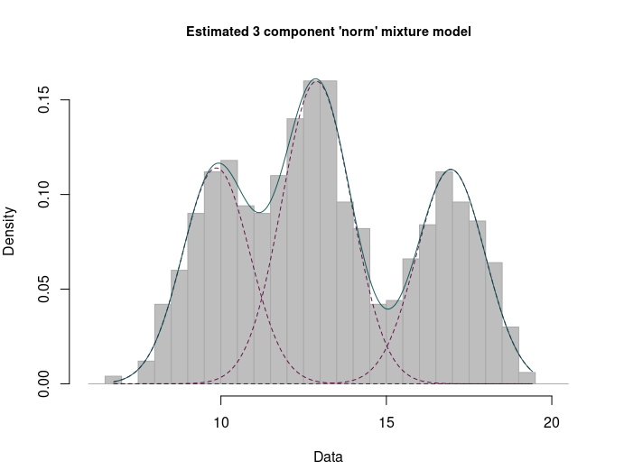

# Summary

The **mixComp** package provides several methods for obtaining a consistent estimate of the complexity of a (univariate) finite mixture. The considered approaches can be loosely grouped into 3 categories:

  - methods built upon the determinants of the Hankel matrix of moments of the mixing distribution; 
  
  - methods based on penalized minimum distance between the unknown probability density and a consistent estimator thereof (the distances considered in this survey are the Hellinger and the $L_2$-distances);
   
  - likelihood ratio test (LRT) - based techniques. 

While not the primary goal, most methods simultaneously estimate the component weights and parameters. 

# Statement of need

**mixComp** can be used on virtually any parametric mixture as long as functions generating random variates and evaluating the density are provided for the component distribution. It is applicable to parametric mixtures well beyond those whose component distributions are included in the **R** package **stats**, making it more customizable than most packages for model-based clustering. The estimation results can be printed out and plotted for further analysis. The package is aimed at practitioners studying phenomena that can be effectively modelled using mixture distributions. In particular, it can be used to identify settings and conditions, under which a certain method provides more accurate estimates than the others.

# Installation

To install from `CRAN`, use:
``` r
install.packages("mixComp")
```

# Section 1. Introduction to finite mixture models and mixComp

Mixture models have been used extensively in statistical applications and have attracted much attention from both theoretical and computational perspectives. The list of works on mixture models is extensive; we can refer to the following papers and books: [@Teicher63], [@LindsayI], [@LindsayII], [@Titterington] and [@McLachlan].

The popularity of such models stems from the fact that they allow for modeling heterogeneous data whose distribution cannot be captured by a single parametric distribution. To account for such heterogeneity, the (unknown) distribution is assumed to result from mixing over some latent parameter in the following sense: the latent parameter is viewed itself as a random variable drawn from some unknown mixing distribution. When this mixing distribution is only assumed to belong to the ensemble of all possible distribution functions, the mixture model is called *nonparametric* and estimation of the mixing distribution requires using some nonparametric estimation method. This includes the well-known nonparametric maximum likelihood estimator (NPMLE) whose fundamental properties were well studied in the seminal work of [@LindsayI], [@LindsayII]. One remarkable property of the NPMLE of the mixing distribution is that it is, under some simple conditions, a discrete distribution function with at most $k$ number of jumps, where $k$ is the number of distinct observations in the random sample drawn from the mixture. This interesting feature is one reason for considering the smaller class of finite mixture models (characterized by a discrete mixing distribution with a finite number of jumps). The model has the following simple interpretation: the population under study is assumed to consist of several homogeneous subpopulations. These subpopulations, typically referred to as the mixture's components, usually have a specific meaning depending on the problem at hand. In some very simple situations, the number of components could be known in advance, in which case the model is *fully parametric* and convergence of classical estimators such as the parametric maximum likelihood estimator (MLE) is known to occur at the fast rate $\sqrt{n}$ (under some conditions). Also, the well-known expectation-maximization (EM) algorithm [@Dempster] can be used to find the MLE of the unknown parameters. However, in many applications such knowledge is rarely available and the number of components has to be estimated from the data. Although the mixture is still finite and the distribution of each component is assumed to belong to some parametric family, the estimation framework in this case is much harder. The goal of **mixComp** is to estimate the unknown complexity using several methods known from the statistical literature. These methods, discussed below, all come with theoretical guarantees for consistency as the sample size gets larger. The performance of the methods varies according to the underlying mixture distribution and the sample size. This will be illustrated below through several synthetic and real datasets.

We start with some formal notation. A distribution $F$ is called a *finite mixture* if its density (we write density throughout and keep in mind that it may be taken with respect to the Lebesgue or the counting measure) is of the form

$$f(x) = \sum_{i=1}^p w_i g_i(x),$$

where $p \in \mathbb{N}$ is the mixture complexity, $(w_1, \dots w_p : \sum_{i=1}^p w_i = 1$, $w_i \geq 0,$ for $i=1,\dots,p)$ are the component weights and the density $g_i(x)$ is the $i$-th component of the mixture. As the scope of **mixComp** is limited to mixtures where the family of the component distributions is known, we replace $g_i(x)$ by a parametric density $g(x; \theta_i)$ indexed by the (possibly multivariate, say $d$-dimensional) parameter $\theta_i$ in the parameter space $\Theta \subseteq \mathbb{R}^d$.

Given some complexity $j$, the two relevant parameter spaces can therefore be defined as

$$\Theta_j = \{\theta_1 \dots \theta_j: \theta_i \in \Theta \subseteq \mathbb{R}^d, \text{ for } i = 1,\dots,j\}$$

and

$$W_j = \{w_1, \dots, w_j: \sum_{i=1}^j w_i = 1, w_i \geq 0, \text{ for } i = 1,\dots,j\}.$$

We assume that the family of the component densities $\{g(x; \theta):\theta \in \Theta\}$ is known, but the component parameters $\textbf{\theta}= (\theta_1, \dots, \theta_p) \in \Theta_p$, the component weights $\textbf{w} = (w_1, \dots, w_p) \in W_p$ and the mixture complexity $p \in \mathbb{N}$ are unknown, with $p$ being the parameter of interest. Suppose now that $F$ is a finite mixture distribution with density $f(x) = \sum_{i=1}^p w_i g(x; \theta_i)$ and $\textbf{X} = \{X_1, \dots, X_n\}$ is an i.i.d. sample of size $n$ from $F$. The **mixComp** package aims to estimate the smallest such $p$, either on its own or by simultaneously estimating the weights $w_i$ and the component parameters $\theta_i$, $i \in 1, \dots, p$.

In this setup, it seems natural to test for the number of components by comparing two consecutive models. Traditionally, the problem of choosing between nested models may be approached by applying the generalized likelihood ratio test and referring to the $\chi^2_r$ distribution to assess significance, where $r$ is given by the number of constraints imposed on the alternative hypothesis $H_1$ to arrive at the null hypothesis $H_0$. In the context of mixture models, there are several issues hindering application of this classical theory as there is no unique way of obtaining $H_0$ from $H_1$: e.g. the two null hypotheses $H_0: w_{j+1} = 0$ and $H_0: \theta_{j+1} = \theta_{1}$ both yield the smaller model, showcasing the difficulties of applying the classical asymptotic theory of the likelihood ratio. This problem has been studied extensively in the literature and numerous approaches to mixture complexity estimation have been suggested, laying the theoretical foundation for the subsequently described algorithms.

Two main features distinguish **mixComp** from other mixture-related **R** [@R] packages: Firstly, it is focused on the estimation of the complexity rather than the component weights and parameters. While these are often estimated as a by-product, all methods contained in **mixComp** are based on theory specifically developed to consistently estimate the number of components in the mixture of interest. Secondly, it is applicable to parametric mixtures well beyond those whose component distributions are included in the **stats** package, making it more customizable than most packages for model-based clustering. 

The packages **mixtools** [see @mixtools] and **flexmix** [see @flexmix1; @flexmix2; @flexmix3] should both be mentioned at this point: aside from **mixtools**'s focus on mixture-of-regressions and non-parametric mixtures which are less relevant to this package, it is widely used to fit (multivariate) normal, multinomial or gamma mixtures with the EM algorithm, also containing routines for selecting the number of components based on information criteria and parametric bootstrapping of the LRT statistic values. However, they are limited to multinomial and normal mixtures as well as mixtures-of-regressions. Second, while **flexmix** was developed to deal with mixtures-of-regression, it sets itself apart from other packages by its extensibility, a design principle that we also aimed for when creating **mixComp**. Other packages dealing with mixture models are **mclust** [@mclust], which fits mixtures of Gaussians using the EM algorithm, **MixSim** [@mixsim], which allows for simulation from mixtures and comparing the performance of clustering algorithms, and **mixdist** [@mixdist], which is used for grouped conditional data. Interested readers can find a comprehensive list of mixture-related packages on the CRAN Task View: Cluster Analysis and Finite Mixture Models website.

Other theoretical work on the estimation of mixture complexity not currently integrated in the package includes

- the method of [@chen] that is reminiscent of the ones described in Section 4 (difference being that the authors consider distribution functions instead densities, i.e. they consider minimizing a penalized distance between the distribution function of the mixture and the empirical distribution function); 

- the approach of [@figueiredo] based on a minimum message length-like criterion (the method struggles to deal with mixtures with very different weights); 

- the procedure of [@xian] based on alternating between splitting and merging the components in an EM-algorithm (requires selecting two thresholds, the choice of which is somewhat unclear when working with a specific dataset); 

- the Bayesian approach of [@miller], taking the usual finite mixture model with Dirichlet weights and putting a prior distribution on the unknown number of components. 

# Section 2. Objects and functions defined in mixComp

Table 1 depicts five object classes defined in **mixComp**. The first two respectively represent a finite mixture distribution and a random sample drawn from such a distribution. The `Mix` object is printed as a matrix of component weights and parameters and is plotted as the density of the specified mixture, showing the overall as well as the component densities. The `rMix` object prints as the vector of observations and plots as a histogram, showcasing the individual components as well as the full sample. Both objects contain a number of attributes giving additional information, details of which can be found in the corresponding **R** help files. 

#### Table 1: Objects and functions defined in mixComp
|  Object class  | Created via                                  | Description                                     |
|:--------------:|:--------------------------------------------:|:-----------------------------------------------:|
| `Mix`          | `Mix`                                        | Represents a finite mixture                     |
| `rMix`         | `rMix`                                       | Randomly generated data from a finite mixture   |
| `datMix`       | `datMix` or `RtoDat`                         | Observed data from (presumably) a finite mixture|
| `hankDet`      | `nonparamHankel`                             | Vector of estimated Hankel matrix determinants  |
| `paramEst`     | `paramHankel(.scaled)`, `L2(.boot).disc`, `hellinger(.boot).disc`, `hellinger(.boot).cont` or `mix.lrt`  | Complexity estimate $\hat{p}$, together with estimates of the weights $\hat{\mathbf{w}}$ and the component parameters $\hat{\mathbf{\theta}}$|

While the creation of `Mix` objects is mostly straightforward, two things should be noted in this regard: First, **mixComp** procedures will search for functions called `rdist` and `ddist` in the accessible namespaces. For most 'standard' distributions, these functions are contained in the **stats** package and do not need to be user-written (compare with the Section 6). To make use of these functions, it is essential that the string `dist` is named correctly (e.g. to create a gaussian mixture on the basis of the **stats** package, `dist` has to be specified as `norm` instead of `normal`, `gaussian` etc. for the package to find the functions `dnorm` and `rnorm`). Second, the names of the list elements of `theta.list`(for the names of the `...` arguments) have to match the names of the formal arguments of the functions `ddist` and `rdist` exactly (e.g. for a gaussian mixture, the list elements have to be named `mean` and `sd`).

The following example creates two `Mix` objects, 3-component mixtures of normal and Poisson distributions. 

``` r
set.seed(0)
# construct a Nix object:
normLocMix <- Mix("norm", discrete = FALSE, w = c(0.3, 0.4, 0.3), 
		   mean = c(10, 13, 17), sd = c(1, 1, 1))
poisMix <- Mix("pois", discrete = TRUE, w = c(0.45, 0.45, 0.1), 
		lambda = c(1, 5, 10))
# plot the mixtures:
plot(normLocMix, main = "3-component normal mixture", cex.main = 0.9)
plot(poisMix, main = "3-component poisson mixture", cex.main = 0.9)
```

 

 


If required, random samples can be generated from these mixtures.
``` r
# generate random samples:
normLocRMix <- rMix(1000, obj = normLocMix)
poisRMix <- rMix(1000, obj = poisMix)
# plot the histograms of the random samples:
plot(normLocRMix, main = "3-component normal mixture", cex.main = 0.9)
plot(poisRMix, main = "3-component poisson mixture", cex.main = 0.9)
```

 

 
  
The third object class shown in Table 1, called `datMix`, represents the data vector $\mathbf{X}$ based on which the mixture complexity should be estimated. These objects are key, as every procedure estimating the order of a mixture takes a `datMix` object as input. Apart from $\mathbf{X}$, it contains other 'static' information needed for the estimation procedure in contrast to 'tuning parameters' which can be changed with every function call. An overview of which 'static' attributes need to be supplied for each complexity estimation routine is given in Table 2. 

#### Table 2: Inputs needed for different functions contained in mixComp
| `R function`            |`dist`|`discrete`|`theta.bound.list`|  `MLE.function` | `Hankel.method` | `Hankel.function` |
|:-----------------------:|:----:|:--------:|:----------------:|:---------------:|:---------------:|:-----------------:|
|`nonparamHankel`         |  x   |          |                  |                 |        x        |         x         |
|`nonparamHankel(.scaled)`|  x   |    x     |         x        | o + i (optional)|        x        |         x         |
|`L2(.boot).disc`         |  x   |    x     |         x        |   i (optional)  |                 |                   |
|`hellinger(.boot).disc`  |  x   |    x     |         x        |   i (optional)  |                 |                   |
|`hellinger(.boot).cont`  |  x   |    x     |         x        |   i (optional)  |                 |                   |
|`mix.lrt`                |  x   |    x     |         x        | o + i (optional)|                 |                   |

In the table, "o" and "i" stand for input used during optimization and initialization.

As an example consider the `waiting` (often assumed to be generated by a normal mixture) from the Old Faithful dataset [@R; @faithful1; @faithful2]. To estimate the number of components of the mixture distribution that provides a suitable approximation to the `waiting` via **mixComp**, the raw data vector of observations $\mathbf{X}$ should be converted to a `datMix` object. Then arguments of the `datMix` function are entered, starting with $\mathbf{X}$ and the string `dist`, specifying $\{g(x;\theta):\theta \in \Theta \}$ and the boolean `discrete`.

``` r
faithful.obs <- faithful$waiting
norm.dist <- "norm"
norm.discrete <- FALSE
```
Now a named list of length $d$ containing the bounds of $\theta \in \Theta \subseteq \mathbf{R}^d$ has to be created. In this example, $\theta = \{\mu, \sigma\} \in \Theta = \mathbf{R} \times (0, \infty) \subseteq \mathbf{R}^2$.

``` r
# define the range for parameter values:
norm.bound.list <- list("mean" = c(-Inf, Inf), "sd" = c(0, Inf))
```
Next, the argument `MLE.function` contains a single function if $d=1$ or a list of functions of length $d$ otherwise, specifying the $d$ functions needed to estimate the MLEs of $\theta$ based on $\textbf{X}$ if $p$ were equal to 1. If this argument is supplied and the `datMix` object is handed over to a complexity estimation procedure relying on optimizing over a likelihood function, the `MLE.function` attribute will be used for the single component case. In case the objective function is either not a likelihood or corresponds to a mixture with more than 1 component, numerical optimization will be used based on **Rsolnp**'s function `solnp` [@solnp, @Rsolnp]. The initial values (for the parameters of a $j$-component mixture, say) supplied to the solver are then calculated as follows: the data $\textbf{X}$ is clustered into $j$ groups by the function `clara` (of the **cluster** package by [@cluster] and the data corresponding to each group is given to `MLE.function`. The size of the groups is taken as initial component weights and the MLE's are taken as initial component parameter estimates. Specifying `MLE.function` is optional and if it is not, numerical optimization is used to find the relevant MLE's.

For a normal mixture, one specifies $2$ functions, namely the MLE of the mean $\hat{\mu}_{MLE} = \frac{1}{n}\sum_{i = 1}^n X_i$ and the MLE of the standard deviation $\hat{\sigma}_{MLE} = \sqrt{\frac{1}{n}\sum_{i = 1}^n (X_i - \hat{\mu}_{MLE})^2}$.

``` r
# define the MLE functions for the mean and sd: 
MLE.norm.mean <- function(dat) mean(dat)
MLE.norm.sd <- function(dat){
sqrt((length(dat) - 1) / length(dat)) * sd(dat)
} 
MLE.norm.list <- list("MLE.norm.mean" = MLE.norm.mean, 
		      "MLE.norm.sd" = MLE.norm.sd)
```
The last two arguments, `Hankel.method` and `Hankel.function`, need to be supplied if the mixture complexity is to be estimated based on the Hankel matrix of the moments of the mixing distribution (see Section 3). 

``` r
method <- "translation"
# define the function for computing the moments:
mom.std.norm <- function(j){
  ifelse(j %% 2 == 0, prod(seq(1, j - 1, by = 2)), 0)
}
```
Finally, all previously generated objects are combined to a `datMix` object.

``` r
# construct a datMix object that summarizes all the necessary information:
faithful.dM <- datMix(faithful.obs, dist = norm.dist, discrete = norm.discrete,
                      theta.bound.list = norm.bound.list,
                      MLE.function = MLE.norm.list, Hankel.method = method,
                      Hankel.function = mom.std.norm)
```
In the preceding example, the data vector $\mathbf{X}$ was taken from an existing dataset. As seen before, the `rMix` function can be used to generate a $n$-sized sample from a specific mixture. If this synthesized data is to be used in simulations (i.e. passed to one of the functions estimating the mixture complexity) an `rMix` object can be converted to a `datMix` object via the `RtoDat` function. Apart from `dist` and `discrete`, all `datMix` arguments have to be supplied to `RtoDat` likewise. 

Unlike the above mentioned objects whose creation precedes any type of mixture complexity estimation, objects of the bottom two classes (see Table 1) contain the results of the estimation procedures. Generally, the functions estimating the number of components differ in the types of families of component densities $\{g(x;\theta):\theta \in \Theta \}$ for which they allow and in whether they provide estimates of the weights $\hat{w}_i$ and the component parameters $\hat{\theta}_i, i \in 1, \dots, \hat{p}$, the latter determining the object class of the estimation result. These differences are shown in Table 3. The function `nonparamHankel` returns an object of class `hankDet`, which is a vector of determinants (scaled and/or penalized), each entry belonging to a certain complexity estimate. The link between these determinants and $p$ will be discussed in the Section 3. `paramEst` objects arise when using any other function estimating the mixture complexity, all of which additionally return estimates of the component weights and parameters. For both object classes, print and plot methods are available to summarize and visualize the estimation results. 

#### Table 3: Distribution restrictions and output types of different functions contained in mixComp
|     R function                    |Restrictions on the family of the component density |Estimation of $\mathbf{w}$ and $\mathbf{\theta}$|
|:---------------------------------:|:--------------------------------------------------:|:----------------------------------------------:|
|`nonparamHankel`                   |Compatible with `explicit`, `translation` or `scale`|                                                |
|`nonparamHankel(.scaled)`          |Compatible with `explicit`, `translation` or `scale`|                       x                        |  
|`L2(.boot).disc`                   |Discrete distributions                              |                       x                        | 
|`hellinger(.boot).disc`            |Discrete distributions                              |                       x                        | 
|`hellinger(.boot).cont`            |Continuous distributions                            |                       x                        | 
|`mix.lrt`                          |                                                    |                       x                        | 


# Section 3. Functions using Hankel matrices

$p$ is characterized by the smallest integer $j$ such that the determinant of the $(j+1) \times (j+1)$ Hankel matrix of the first $2j$ moments of the mixing distribution equals 0. It can be shown that this determinant is 0 for all $j \geq p$. Formally, for any vector $\mathbf{c} = (c_0, \dots, c_{2k}) \in \mathbb{R}^{2k+1}$ with $c_0 = 1$, the Hankel matrix of $\mathbf{c}$ is defined as the $(k+1)\times(k+1)$ matrix given by

$$H(\mathbf{c})_{i,j} = c_{i+j-2}, \quad \quad 1 \leq i,j \leq k+1.$$

Let $\textbf{c}^{2j+1} \in \mathbb{R}^{2j+1}$ be the vector containing the first $2j+1$ (raw) moments of the mixing distribution. For finite mixture models, this amounts to

$$c^{2j+1}_k = \sum_{i=1}^p w_i \theta^k_i, \quad \text{ for } k \in \{0,\dots, 2j\} \text{ and } \theta_i \in \mathbb{R}, i \in \{1,\dots,p\}.$$

Then, for all $j \geq 1$, $H(\textbf{c}^{2j+1})$ is non-negative and

$$ p = \min\{j \geq 1 : \det H(\textbf{c}^{2j+1}) = 0\}. $$

Making use of this fact, the first approach to estimating the order of a mixture that is implemented in **mixComp** relies on initially finding a consistent estimator of $\textbf{c}^{2j+1}$ based on $\textbf{X}$, say $\hat{\textbf{c}}^{2j+1}$, to then iteratively calculate the applicable Hankel matrix while increasing the assumed order $j$ until a sufficiently small value of $\det H(\hat{\textbf{c}}^{2j+1})$ is attained. However, since $\det H(\hat{\textbf{c}}^{2j+1})$ should be close to 0 for all $j \geq p$, this would lead to choosing $\hat{p}$ rather larger than the true value. Therefore [@hankel] define the empirical penalized objective function as

$$J_n(j) := \lvert \det H(\hat{\textbf{c}}^{2j+1}) \rvert + A(j)l(n),$$

with $l(n)$ being a positive function converging to $0$ as $n\to\infty$ and $A(j)$ being positive and strictly increasing. 

$$\hat{p} := \text{argmin}_{j \in \mathbb{N}} J_n(j)$$

is then a consistent estimator of $p$.

As an extension to simply adding a penalty term to the determinant, a scaling approach was considered by [@lilian]. Let $\hat{d}_j = \det H(\hat{\textbf{c}}^{2j+1})$, $d_j = \det H(\textbf{c}^{2j+1})$ and $j_m \geq p, j_m \in \mathbb{N}$. Since the estimated moments $\hat{\textbf{c}}^{2j+1}$ are asymptotically normal, one can apply the delta method giving

$$
\sqrt{n} \cdot
  \big(
    \hat{d}_1-d_1,
    \dots,
    \hat{d}_{p-1}-d_{p-1},
    \hat{d}_p-0,
    \dots,
    \hat{d}_{j_m}-0
  \big)^\top \quad \overset{\mathcal{D}}{\longrightarrow} \quad \mathcal{N}(0_{j_m \times 1}, \Sigma_ {j_m \times j_m}).
$$

Instead of inspecting the vector $(\hat{d}_1, \dots, \hat{d}_{j_m})$, one could base the complexity analysis on a vector of scaled determinants employing a nonparametric bootstrap procedure on $\textbf{X}$: let $\tilde{\Sigma} \in \mathbb{R}^{j_m \times j_m}$ denote the covariance matrix of the determinants $\hat{d}^{*b}_{j}$ calculated on the $b^{\text{th}}$ bootstrap sample for $b=1, \dots, B$ and $j = 1, \dots j_m$. Note that 

$$\tilde{\Sigma} \approx \frac{\Sigma}{n} \quad \text{ as }B \to \infty, n \to \infty,$$

write $\tilde{\Sigma}^{-1/2} = \sqrt{n} \cdot \hat{\Sigma}^{-1/2}$. Define the rescaled vector 
\begin{equation} \label{eq:scaled}
\big( y_1, \dots, y_p, \dots, y_{j_m} \big)^\top := \sqrt{n} \cdot {\hat{\Sigma}}^{-1/2} \big(
   \hat{d}_1,
    \dots,
    \hat{d}_p,
    \dots,
    \hat{d}_{j_m}
  \big)^\top.
\end{equation}

In the case of the scaled version, the criterion to be minimized becomes 

$$
{J_n(j)}_{scaled} := \vert y_j \vert + A(j)l(n) \cdot \sqrt{n}.
$$

(the penalty function is multiplied by $\sqrt{n}$).

This approach was proposed to address the issue of determinants already being very small from the beginning (even for $j = 1$), which, in the simulations by [@lilian], made it hard to discern the 'best' complexity estimate, a problem that was not reduced much by solely adding a penalty term.  

With this general framework, the computation now hinges on calculating $\hat{\textbf{c}}^{2j+1}$. **mixComp** offers 3 methods to do so. The method to use depends on the family of component densities $\{g(x;\theta):\theta \in \Theta \}$ and is linked to some function $f_j(\textbf{X})$ needed to estimate $\hat{\textbf{c}}^{2j+1}$. The calculation method and the relevant function are specified when creating the `datMix` object as arguments `Hankel.method` and `Hankel.function`.


#### 1. `Hankel.method = "explicit"`

`Hankel.method = "explicit"` can be applied when a closed form expression for estimates of the moments of the mixing distribution exists. `Hankel.function` then contains the function explicitly estimating $\textbf{c}^{2j+1}$. 

Consider a mixture of geometric distributions, where

$$c^{2j+1}_j = 1 - \sum_{l = 0}^{j-1} f(l) = 1 - F(j-1),$$

with $F$ the true cumulative distribution function. Hence one may take

$$\hat{c}^{2j+1}_j = 1 - \hat{F}(j-1)$$

as an estimator, with $\hat{F}$ being the empirical distribution function.

``` r
# define the function for computing the moments:
explicit.geom <- function(dat, j){
  1 - ecdf(dat)(j - 1)
}
```

Now consider what [@hankel, p. 283, equation (3)] called the 'natural' estimator, i.e. using

\begin{equation}\label{eq:1}
\hat{c}^{2j+1}_j = f_j\left(\frac{1}{n} \sum_{i=1}^n \psi_j(X_i)\right)
\end{equation}

when

\begin{equation}\label{eq:2}
c^{2j+1}_j = f_j(\mathbb{E}[\psi_j(X_i)]).
\end{equation}

The estimators of this form may be supplied as `Hankel.method = "explicit"` with `Hankel.function` equal to the right-hand side of \autoref{eq:1}. For example, the 'natural' estimator is applicable in the case of Poisson mixtures. If $Y \sim Pois(\lambda)$, it is a known fact that

$$\lambda^j = \mathbb{E}[Y(Y-1)\dots(Y-j+1)],$$

which, in combination with \autoref{eq:1} and \autoref{eq:2} suggests using

$$\hat{c}^{2j+1}_j = \frac{1}{n} \sum_{i=1}^n X_i(X_i-1)\dots(X_i-j+1)$$

as an estimator.

``` r
# define the function for computing the moments:
explicit.pois <- function(dat, j){
  mat <- matrix(dat, nrow = length(dat), ncol = j) - 
         matrix(0:(j-1), nrow = length(dat), ncol = j, byrow = TRUE)
  return(mean(apply(mat, 1, prod)))
}
```

#### 2. `Hankel.method = "translation"`
 
In Example 3.1., [@hankel, p.284] describe how $\textbf{c}^{2j+1}$ can be estimated if the family of component distributions $(G_\theta)$ is given by $\text{d}G_\theta(x) = \text{d}G(x-\theta)$, where $G$ is a known probability distribution whose moments can be given explicitly. In this case, a triangular linear system can be solved for the estimated moments of the mixing distribution $\hat{\textbf{c}}^{2j+1}$ using the empirical moments of the mixture distribution and the known moments of $G$. The former can be estimated from the data vector $\mathbf{X}$ whereas the latter has to be supplied by the user. Thus, `Hankel.function` contains a function of $j$ returning the $j$-th (raw) moment of $G$.

Consider a mixture of normal distributions with unknown mean and unit variance. Then $G$ is the standard normal distribution, and its $j$-th moment $m_j$ is defined as

$$
m_j=
\begin{cases}
0 & \text{if } j \text{ odd},\\
(j-1)!! & \text{if } j \text{ even}.
\end{cases}
$$

``` r
# define the function for computing the moments:
mom.std.norm <- function(j){
  ifelse(j %% 2 == 0, prod(seq(1, j - 1, by = 2)), 0)
}
```

#### 3. `Hankel.method = "scale"`

In Example 3.2. [@hankel, p.285] describe how $\textbf{c}^{2j+1}$ can be estimated if the family of component distributions $(G_\theta)$ is given by \linebreak $\text{d}G_\theta(x) = \text{d}G(\frac{x}{\theta})$, where $G$ is a known probability distribution whose moments can be given explicitly. Likewise, a triangular linear system can be solved for $\hat{\textbf{c}}^{2j+1}$, using the empirical moments of the mixture distribution and the known moments of $G$. `Hankel.function` contains a function of $j$ returning the $j$-th moment of $G$. Note that squares have to be taken everywhere if for some integer $j$, $m_j = 0$.

As an example, consider a mixture of normal distributions with zero mean and unknown variance. Then $G$ is again the standard normal distribution, and its $j$-th moment is defined as above.

Coming back to the goal of complexity estimation, the function `nonparamHankel` returns all estimated determinant values corresponding to complexities up to `j.max`, so that the user can pick the lowest $j$ generating a sufficiently small determinant. The function allows the inclusion of a penalty term as a function of the sample size `n` and the currently assumed complexity `j` which will be added to the determinant value (by supplying `pen.function`), and/or scaling of the determinants (by setting `scaled  = TRUE`). For scaling, a nonparametric bootstrap is used to calculate the covariance of the estimated determinants, with `B` being the size of the bootstrap sample. The inverse of the square root (i.e. the matrix $S$ such that $A = SS$, where $A$ is the (square) covariance matrix. The procedure uses **expm**'s `sqrtm` [@expm]) of this covariance matrix is then multiplied with the estimated determinant vector to get the scaled determinant vector.

We will initially apply this method to the two already generated datasets of 3-component Poisson and normal mixtures using the penalty $A(j)l(n) = \frac{j\log(n)}{\sqrt{n}}$ and scaling the determinants according to \autoref{eq:scaled}.

For converting the previously simulated samples from 3-component Poisson and normal mixtures yielding the objects of class `rMix` to objects of class `datMix` one should apply the `RtoDat` function:

``` r
MLE.pois <- function(dat) mean(dat)

# create datMix objects:
pois.dM <- RtoDat(poisRMix, theta.bound.list = list(lambda = c(0, Inf)), 
                  MLE.function = MLE.pois, Hankel.method = "explicit",
                  Hankel.function = explicit.pois)


normLoc.dM <- RtoDat(normLocRMix, theta.bound.list = norm.bound.list,
                     MLE.function = MLE.norm.list, Hankel.method = "translation",
                     Hankel.function = mom.std.norm)
```

For the scaled version, the penalty should be multiplied by $\sqrt{n}$: 

``` r
# define the penalty function:
pen <- function(j, n){
  j * log(n)
}

# apply the nonparamHankel function to the datMix objects:
set.seed(1)
poisdets_sca_pen <- nonparamHankel(pois.dM, j.max = 5, scaled = TRUE, 
                                   B = 1000, pen.function = pen)
normdets_sca_pen <- nonparamHankel(normLoc.dM, j.max = 5, scaled = TRUE, 
                                   B = 1000, pen.function = pen)
```

One can print and plot the results:

``` r
# print the results (for the Poisson mixture)
print(poisdets_sca_pen)
# plot results for both mixtures:
par(mar = c(5, 5, 1, 1))
plot(poisdets_sca_pen, main = "3-component poisson mixture", cex.main = 0.9)
plot(normdets_sca_pen, main = "3-component normal mixture", cex.main = 0.9)
```


The results indicate that while theoretically sound, the scaled version of the Hankel method can struggle to correctly identify the number of components in practice and it can be quite difficult to determine the order estimate from the vector of estimated determinants alone. Therefore, the package includes another option of estimating $p$ based on Hankel matrices, using an approach estimating $\mathbf{w}$ and $\mathbf{\theta}$. The `paramHankel` procedure initially assumes the mixture to only contain a single component, setting $j = 1$, and then sequentially tests $p = j$ versus $p = j+1$ for $j = 1,2, \dots$, until the algorithm terminates. To do so, it determines the MLE for a $j$-component mixture $(\hat{\mathbf{w}}^j, \hat{\mathbf{\theta}}^j) = (\hat{w}_1, \dots, \hat{w}_j, \hat{\theta}_1, \dots, \hat{\theta}_j) \in W_j \times \Theta_j$, generates `B` parametric bootstrap samples of size $n$ from the distribution corresponding to $(\hat{\mathbf{w}}^j, \hat{\mathbf{\theta}}^j)$ and calculates `B` determinants of the corresponding $(j+1) \times (j+1)$ Hankel matrices. The null hypothesis $H_0: p = j$ is rejected and $j$ is increased by $1$ if the determinant value based on the original data vector $\textbf{X}$ lies outside of the interval $[ql, qu]$, a range specified by the `ql` and `qu` empirical quantiles of the bootstrapped determinants. Otherwise, $j$ is returned as the order estimate $\hat{p}$, that is $\hat p$ is the first order for which the null hypothesis is not rejected.  

`paramHankel.scaled` functions similarly to `paramHankel` with the exception that the bootstrapped determinants are scaled by the empirical standard deviation of the bootstrap sample. To scale the original determinant, `B` nonparametric bootstrap samples of size $n$ are generated from the data, the corresponding determinants are calculated and their empirical standard deviation is used.

Applying `paramHankel.scaled` to the same Poisson and Normal mixtures results in the correct identification of the mixture complexity in both cases:

``` r
# apply papamHankel.scaled to datMix objects:
set.seed(1)
pois_sca_pen <- paramHankel.scaled(pois.dM)
norm_sca_pen <- paramHankel.scaled(normLoc.dM)
# plot the results for both mixtures:
par(mar=c(5, 5, 1, 1))
plot(pois_sca_pen,)
plot(norm_sca_pen)
```





As a real-world example consider the Children dataset (from the Annual Report of the pension fund S.P.P. of 1952), initially introduced in [@thisted]. It entails data on 4075 widows who recieved pension from the fund, with their number of children being the variable of interest. For example, there are 3062 widows without children, 587 widows with one child, etc. Many authors have noted that this data is not consistent with being a random sample from a Poisson distribution since the number of zeros found in the data is too large. Thisted approached this by fitting a mixture of two populations, one which is always zero and one which follows a Poisson distribution. We want to investigate how the Hankel matrix methods compare when fitting the data to a mixture of Poissons.

The estimation process starts with the construction of the `datMix` object.

``` r
# convert the data to vector:
children.obs <- unlist(children)
# define the MLE function:
MLE.pois <- function(dat) mean(dat)
# construct a datMix object:
children.dM <- datMix(children.obs, dist = "pois", discrete = TRUE, 
                      Hankel.method = "explicit", 
                      Hankel.function = explicit.pois,
                      theta.bound.list = list(lambda = c(0, Inf)), 
                      MLE.function = MLE.pois)
```


First, we check the nonparametric method. We define the penalty $A(j)l(n)$ as $\frac{j\log(n)}{\sqrt{n}}$ and scale the determinants according to \autoref{eq:scaled} (by multiplying the penalty by $\sqrt{n}$). The result suggests that the data comes from a 2-component mixture.

``` r
# define the penalty:
pen <- function(j, n) j * log(n)
# estimate the number of components:
set.seed(0)
(det_sca_pen <- nonparamHankel(children.dM, j.max = 5, scaled = TRUE, 
                              B = 1000, pen.function = pen))
#plot the results:
plot(det_sca_pen, main = "Non-parametric Hankel method for Children dataset",
     cex.main = 0.9)
```


Next, we check the fit of the parametric version. The printed result of `paramHankel.scaled` shows that this method also suggests 2 for the number of components, with the first component corresponding to a Poisson distribution with $\lambda = 0.0306$ (the limit case $\lambda = 0$ results in a point mass at 0, and this fit nicely lines up with the idea of a component accounting for only the zero observations). 
``` r
set.seed(0)
param_sca <- paramHankel.scaled(children.dM, j.max = 5, B = 1000, ql = 0.025, 
                          qu = 0.975)
plot(param_sca, breaks = 8, ylim = c(0, 0.8))
```


# Section 4. Functions using distances

Unlike the theory on Hankel matrices introduced in Section 3, many theoretical considerations rely on estimates of the weights $\mathbf{w}$ and the component parameters \mbox{\boldmath$\theta$}. As mentioned in the introduction, it is assumed that the family of component densities $\{g(x;\theta): \theta \in \Theta \}$ is known. To embed the subsequent algorithms in a more theoretical framework, consider the parametric family of mixture densities

$$\mathcal{F}_j = \{ f_{j, \mathbf{w},\mathbf{\theta}} : (\mathbf{w}, \mbox{\boldmath$\theta$}) \in W_j \times \Theta_j \}.$$ 


With $\{g(x;\theta): \theta \in \Theta \}$ set in advance, elements of $\mathcal{F}_j$ can be written as

$$f_{j,\mathbf{w},\mathbf{\theta}}(x) = \sum_{i = 1}^j w_i g(x; \theta_i).$$

The support of $f$ will depend on the support of $g$ and $\mathcal{F}_j \subseteq \mathcal{F}_{j+1}$ (by setting $w_{j+1} = 0$) for all $j$. Now take a specific mixture $f_0 = f_{p_0, \mathbf{w}_0,\mathbf{\theta}_0}$, where $(\mathbf{w}_0,\mathbf{\theta}_0) \in W_{p_0} \times \Theta_{p_0}$. Clearly, the mixture complexity is defined as

$$p_0 = \min\{j:f_0 \in \mathcal{F}_j\}.$$

The above suggests an estimation procedure based on initially finding the 'best' possible estimate (in a sense to be determined) $(\hat{\mathbf{w}}^j, \hat{\mathbf{\theta}}^j) \in W_j \times \Theta_j$ for a given value of $j$, in order to compare the thereby specified probability density/mass function 

$$\hat{f}_j(x) = f_{j, \hat{\mathbf{w}}^j, \hat{\mathbf{\theta}}^j}(x),$$

with a non-parametric density/probability mass estimate $\tilde{f}_n(x)$. As the classes $\mathcal{F}_j$ and $\mathcal{F}_{j+1}$ are nested, the distance $D$ (to be defined below) between $\hat{f}_j$ and $\tilde{f}_n$ will only decrease with $j$. Thus, it makes sense to add some penalty term (increasing in $j$) to $D(\hat{f}_j, \tilde{f}_n)$ and find the first value of $j$ where the penalized distance for $j$ is smaller than that for $j+1$. Rearranging the terms gives rise to an algorithm starting at $j = 1$, involving some threshold $t(j,n)$ depending on the penalty, where, if $j$ is the first integer satisfying

\begin{equation}\label{eq:distances}
D(\hat{f}_j, \tilde{f}_n) - D(\hat{f}_{j+1}, \tilde{f}_n) \leq t(j,n),
\end{equation}

then $j$ is taken as the estimate $\hat{p}$. If the inequality is not fulfilled, $j$ is increased by $1$ and the procedure is repeated. Consistency of estimators defined this way has been shown in a number of cases, amongst them those used by the **mixComp** algorithms, and the reader is referred to [@l2; @hell; @hellcont] for the proofs relevant to the results implemented in the package.

The preceding notation was held as broad as possible, since different distance measures $D$ and non-parametric estimators $\tilde{f}_n$ can be used. Those relevant to the package are mostly well-known, still, definitions can be found in the Appendix. Three procedures are implemented in **mixComp** based on the foregoing methodology: `L2.disc`, `hellinger.disc` and `hellinger.cont`.

#### 1. `L2.disc`

`L2.disc` employs the squared $L_2$ distance as the distance measure $D$ and is only suitable for discrete mixtures since the nonparametric estimate $\tilde{f}_n$ is defined as the empirical probability mass function. In this setting, the 'best' estimate $(\hat{\mathbf{w}}^j, \hat{\mathbf{\theta}}^j) \in W_j \times \Theta_j$ for a given $j$ corresponds to

$$(\hat{\mathbf{w}}^j, \hat{\mathbf{\theta}}^j) = \text{argmin}_{(\mathbf{w}, \mathbf{\theta})} L_2^2(f_{j, \mathbf{w}, \mathbf{\theta}}, \tilde{f_n}) 
= \text{argmin}_{(\mathbf{w}, \mathbf{\theta})} \left\{ \sum_{x=0}^{\infty} f_{j, \mathbf{w}, \mathbf{\theta}}^2(x) - \frac{2}{n} \sum_{i=1}^{n}f_{j, \mathbf{w}, \mathbf{\theta}}(X_i)\right\}.$$

As the squared $L_2$ distance might involve an infinite sum (for distributions with infinite support), the user has the option to determine the cut-off value using the `n.inf` argument, which is set to 1000 by default. The parameters $(\hat{\mathbf{w}}^{j+1}, \hat{\mathbf{\theta}}^{j+1})$ are obtained analogously. Once both parameter sets have been determined, the difference in their respective squared $L_2$ distances to $\tilde{f}_n$ is compared to a `threshold`  $t(j,n)$. The threshold function can be entered directly or one of the predefined thresholds, called `LIC` or `SBC` given respectively by

$$\frac{0.6}{n} \ln\left(\frac{j+1}{j}\right) \quad\quad \text{ and} \quad\quad \frac{0.6 \ln(n)}{n} \ln\left(\frac{j+1}{j}\right)$$

can be used. If a customized function is used, its arguments have to be named `j` and `n`. If the difference in squared distances is smaller than the selected threshold, the algorithm terminates and the true order is estimated as $j$, otherwise $j$ is increased by 1 and the procedure starts over. The reader is invited to consult [@l2] for further details.

#### 2. `hellinger.disc`

This function presents an alternative estimation procedure for *discrete* mixtures, working similarly to `L2.disc`, however, using a different measure of distance and thresholds. It is based on the squared Hellinger distance, causing the 'best' estimate $(\hat{\mathbf{w}}^j, \hat{\mathbf{\theta}}^j) \in W_j \times \Theta_j$ for a given $j$ to equal

$$(\hat{\mathbf{w}}^j, \hat{\mathbf{\theta}}^j) = \text{argmin}_{(\mathbf{w}, \mathbf{\theta})} H^2(f_{j, \mathbf{w}, \mathbf{\theta}}, \tilde{f_n}) 
= \text{argmax}_{(\mathbf{w}, \mathbf{\theta})} \sum_{x=0}^{X_{(n)}} \sqrt{f_{j, \mathbf{w}, \mathbf{\theta}}(x) \tilde{f}_n(x)},$$

with $X_{(n)} = \max_{i = 1}^n (X_i)$. The relevant theory can be found in [@hell]. In accordance with their work, the two predefined thresholds are given by

$$\text{AIC} = \frac{d+1}{n} \quad \quad \text{and} \quad \quad \text{SBC} = \frac{(d+1)\ln(n)}{2n}$$

(recall that $d$ is the dimension, i.e., $\Theta \subseteq \mathbb{R}^d$).  

#### 3. `hellinger.cont`
 
Unlike the two preceding functions, this procedure is applicable to *continuous* mixture models and uses a kernel density estimator (KDE) as $\tilde{f}_n$. Its `bandwidth` can be chosen by the user, or the adaptive KDE found in [@adap, p. 1720, equation (2)] may be used by specifying `bandwidth = "adaptive"`. The calculations are based on the continuous version of the squared Hellinger distance, where the 'best' estimate $(\hat{\mathbf{w}}^j, \hat{\mathbf{\theta}}^j) \in W_j \times \Theta_j$ for a given $j$ corresponds to

\begin{equation}\label{eq:hellcont}
(\hat{\mathbf{w}}^j, \hat{\mathbf{\theta}}^j) = \text{argmin}_{(\mathbf{w}, \mathbf{\theta})} H^2(f_{j, \mathbf{w}, \mathbf{\theta}}, \tilde{f_n}) 
= \text{argmax}_{(\mathbf{w}, \mathbf{\theta})} \int \sqrt{f_{j, \mathbf{w}, \mathbf{\theta}}(x)\tilde{f}_n(x)}\ dx.
\end{equation}

Since the computational burden of optimizing over an integral to find the 'best' weights and component parameters is immense, the algorithm approximates the objective function given by \autoref{eq:hellcont} by sampling $n_s = $ `sample.n` observations $Y_i$ from $\tilde{f}_n(x)$ and setting

$$
(\hat{\mathbf{w}}^j, \hat{\mathbf{\theta}}^j) = \text{argmax}_{(\mathbf{w}, \mathbf{\theta})} \sum_{i = 1}^{n_s} \sqrt{\frac{f_{j, \mathbf{w}, \mathbf{\theta}}(Y_i)}{\tilde{f}_n(Y_i)}}.
$$

This procedure uses the same thresholds as `hellinger.disc`.

As before, we initially show the fit these methods yield on the two artificial datasets. As can be seen in the resulting plots, both `hellinger.disc` and `hellinger.cont` correctly estimate that the data comes from 3-component mixtures.

``` r
set.seed(0)
h_disc_pois <- hellinger.disc(pois.dM, threshold = "AIC")
h_cont_norm <- hellinger.cont(normLoc.dM, bandwidth = 0.5, sample.n = 5000, 
                      threshold = "AIC")
par(mar = c(5, 5, 1, 1))
plot(h_disc_pois)
plot(h_cont_norm)
```


For a real-world example, refer back to the `faithful` dataset and the corresponding `datMix` object which was created in Section 1. Fitting the distance methods to a continuous density requires a choice of bandwidth. While using the adaptive bandwidth is an option, if the user does not want to do so, it is recommended to use the function `kdensity` from the package **kdensity** [@kdensity] which automatically selects an optimal bandwidth (can be accessed via `kdensity(data)$bw`). If the user wants to compare different bandwidth values, it is advisable to look at the plots of the respective kernel density estimates using `kdensity` and to choose one that captures the shape of the data well without fitting to noise.

The following figures illustrate the above point by showing the KDE of the Old Faithful data with bandwidths 1, 4 and 8. Here, 4 seems to be an appropriate choice.


`hellinger.cont` fits a 2-component mixture to the data, which fits the data well and comprises similar parameter estimates to those found in the literature.

``` r
# estimate the number of components:
library(kdensity)
res <- hellinger.cont(faithful.dM, bandwidth = kdensity(faithful.obs)$bw,
                      sample.n = 5000, threshold = "AIC")
plot(res)
```


At this point, it is worth having a closer look at the thresholds. They each satisfy $t(j,n) \rightarrow 0$ as $n \rightarrow \infty$, the sole condition the authors require. Now, the consistency proofs for estimators defined via \autoref{eq:distances} all rely on the fact that, as $n \rightarrow \infty$,

$$D(\hat{f}_j, \tilde{f}_n) - D(\hat{f}_{j+1}, \tilde{f}_n) \rightarrow d_j > 0, \text{ for } j < p$$

and

$$D(\hat{f}_j, \tilde{f}_n) - D(\hat{f}_{j+1}, \tilde{f}_n) \rightarrow 0, \text{ for } j \geq p,$$

where $p$ is the true complexity (compare with [@l2, p. 4253, Proof of the Theorem], [@hell, p. 4383, Proof] and [@hellcont, p. 1485, Proof of Theorem 1]. If however $t(j,n)$ goes to 0 faster than $D(\hat{f}_j, \tilde{f}_n) - D(\hat{f}_{j+1}, \tilde{f}_n)$ for $j \geq p$, asymptotically, the decision rule outlined above will always lead to $j$ being rejected. Therefore, a second condition should be placed on $t(j,n)$, namely choosing it in accordance with 

$$D(\hat{f}_p, \tilde{f}_n) - D(\hat{f}_{p+1}, \tilde{f}_n) = o_p(t(j,n)).$$

Neither the $L_2$ Information Criterion  (LIC) nor the Akakike Information Criterion (AIC), nor in the continuous case, the Schwarz Bayesian Criterion (SBC), satisfy this condition, yet they are still part of the package for two reasons. First, since they were used in the original papers, they are included for the sake of completeness and reproducibility of original results. Second, consistency is an asymptotic property, and while the aforementioned thresholds do not fulfill it, they still perform well (and not rarely better than consistent thresholds) for smaller sample sizes. In the example above, the number of components is correctly identified under the non-consistent AIC threshold. Nonetheless, the user will get a warning when using one of non-consistent predefined thresholds.

The preceding example shows that $\hat{p}$ directly depends on the chosen threshold $t(j, n)$, as is also obvious from Equation \autoref{eq:distances}. While some thresholds can be motivated better than others from a theoretical perspective, the choice will ultimately always remain somewhat arbitrary. It would thus be desirable to have versions of the preceding functions which do not suffer from this drawback. `L2.boot.disc`, `hellinger.boot.disc` and `hellinger.boot.cont` all work similarly to their counterparts, with the exception that the difference in distances is not compared to a predefined threshold but a value generated by a bootstrap procedure.  At every iteration (of $j$), the procedure sequentially tests $p = j$ versus $p = j+1$ for $j = 1,2, \dots$, using a parametric bootstrap to generate `B` samples of size $n$ from a $j$-component mixture given the previously calculated 'best' parameter values $(\hat{\mathbf{w}}^j, \hat{\mathbf{\theta}}^j)$. For each of the bootstrap samples, again the 'best' estimates corresponding to densities with $j$ and $j+1$ components are calculated, as well as their difference in distances from $\tilde{f}_n$. The null hypothesis $H_0: p = j$ is rejected and $j$ is increased by $1$ if the original difference $D(\hat{f}_j, \tilde{f}_n) - D(\hat{f}_{j+1}, \tilde{f}_n)$ lies outside of the interval $[ql, qu]$, specified by the `ql` and `qu` empirical quantiles of the bootstrapped differences. Otherwise, $j$ is returned as the order estimate $\hat{p}$. 

Since the bootstrap version returns a very similar result to the threshold version on the Old Faithful dataset, we introduce a new example here. Consider the so-called Shakespeare dataset which comprises the number of occurrences of the words that Shakespeare used in his writings. For example, the number of times Shakespeare used a word only once is 14 376, while the number of times the same word occurred exactly 10 times in his writing is 363. The same data have been considered in other papers, see e.g., [@sp68], [@Efron1976], [@CheeWang2016] and [@balabdkulagina]. In the last three papers, the underlying statistical question that the authors wanted to answer is: how many words did Shakespeare actually know? This problem is known under the name of 'species richness' and can be solved using a variety of approaches. The goal is to use the observed frequencies of species, here words, to estimate the unobserved number of words that Shakespeare knew and did not use in his writings. While there is a whole spectrum of methods for estimating species richness, we limit ourselves here to motivate fitting a finite mixture of geometrics to the data. It is known from [@steutel69] that the class of completely monotone probability mass functions defined on the set of non-negative integers, that is the class of $p$ such that $(-1)^k \nabla^k p(i) \ge 0$ for all integers $k \ge 0, i \ge 0$ coincides with the class of all mixtures of geometrics probability mass functions (here $\nabla p = p(i+1) - p(i)$ and $\nabla^{r+1} \equiv \nabla \circ \nabla^r $ for any integer $r \ge 1$). In [@bdF2019], the monotone complete least squares estimator (LSE) was defined for such class, which is the first non-parametric estimator that was considered for an element in such a family. Complete monotonicity can be defined on any subset of the set of integers of the form $\{a, a+1, \ldots \} $ for $ a \ge 1$ since the change of variable $x \mapsto x-a$ brings us back to complete monotonicity on $\{0, 1, \ldots \}$. It can be clearly seen ([@balabdkulagina]) that the complete monotone estimator fits very well the empirical estimator of the word occurrences. This result strongly suggests that complete monotonicity is a very appropriate model. In the scope of this paper, we want to explore how fitting a finite mixture of geometric distributions with unknown number of components works for this dataset. This alternative approach is actually inspired by the fact that the complete monotone LSE is itself a finite mixture of geometrics (with a random number of components). Such a result is rather universal and its exact statement can be found in Proposition 2.3 in [@bdF2019]. 

Since we inherently do not observe the number of words Shakespeare did not use, the data start at 1. However, using $Y = X-1$ and assuming $Y$ is a geometric mixture with parameters $\{p, w_1, \dots, w_p, \theta_1, \dots, \theta_p\}$ leads to the following model for $X$:

\begin{equation}\label{eq:shakespeare}
f(x)  =  w_1  (1-\theta_1)^{x-1}  \theta_1  +  \ldots  +  w_{p} (1-\theta_{p})^{x-1}  \theta_{p}, \ \ x \in \{1,2,\ldots \, 100\}
\end{equation}

In accordance with the **R**-function `dgeom`, the parametrization we use for the probability mass function of a geometric distribution means that $\theta_i \in [0,1)$ is the success probability for the $i$-th component, $i~\in~\{1, \ldots, p\}$. Building on \autoref{eq:shakespeare}, the clear appropriateness of the complete monotone model for the word frequencies in the Shakespeare data can be complemented by a more applied interpretation, its underyling assumption being that words in any language belong to different categories depending on the context in which they are used. As there is a finite number of words, this justifies the appropriateness of fitting a finite mixture model, whose components would correspond to the aforementioned categories. With the $i$-th component distribution given by $g(x;\theta_i) = (1-\theta_i)^{x-1}  \theta_i,\ x = 1,2,\dots$, this expression can be seen as the probability of a word belonging to category $i$ not appearing (in some new work) after having previously been used $x$ times.

The `datMix` object corresponding to the Shakespeare dataset is generated as follows: 

``` r
shakespeare.obs <- unlist(shakespeare) - 1
# define the MLE function:
MLE.geom <- function(dat) 1 / (mean(dat) + 1)

Shakespeare.dM <- datMix(shakespeare.obs, dist = "geom", discrete = TRUE, 
MLE.function = MLE.geom, theta.bound.list = list(prob = c(0, 1)))

# estimate the number of components and plot the results:
set.seed(0)
res <- hellinger.boot.disc(Shakespeare.dM, B = 50, ql = 0.025, qu = 0.975)
plot(res)
```


`hellinger.boot.disc` estimates that the data comes from a 3-component geometric mixture (thus clustering the english words Shakespeare used into three categories).

# Section 5. Functions using LRTS

As a third option of estimating the mixture complexity, the **mixComp** package provides an algorithm based on the likelihood ratio test statistic (LRTS), sequentially testing $p = j$ versus $p = j+1$ for $j = 1,2, \dots$, until the algorithm terminates. As noted in Section 1, it is not possible to use the generalized likelihood ratio test in the context of mixture models directly as the standard way of obtaining the asymptotic distribution of the LRTS under the null hypothesis cannot be applied. However, one can get estimates of the test's critical values by employing a bootstrap procedure.

Making use of this approach, the function `mix.lrt` iteratively increases the assumed order $j$ and finds the MLE for both, the density of a mixture with $j$ and $j+1$ components, giving $(\hat{\mathbf{w}}^{j}, \hat{\mathbf{\theta}}^{j}) \in W_j \times \Theta_j$ and $(\hat{\mathbf{w}}^{j+1}, \hat{\mathbf{\theta}}^{j+1}) \in W_{j+1} \times \Theta_{j+1}$. It then calculates the corresponding LRTS, defined as

$$\text{LRTS}= -2\ln\left(\frac{L_0}{L_1}\right) \quad \text{, with}$$

$$L_0 = L_{\textbf{X}}(\hat{\mathbf{w}}^{j}, \hat{\mathbf{\theta}}^{j}) \quad\quad \text{and} \quad\quad L_1 = L_{\textbf{X}}(\hat{\mathbf{w}}^{j+1}, \hat{\mathbf{\theta}}^{j+1})\text{,}$$

$L_{\textbf{X}}$ being the likelihood function given the data ${\textbf{X}}$.

Next, a parametric bootstrap is used to generate `B` samples of size $n$ from a $j$-component mixture given the previously calculated MLE $(\hat{\mathbf{w}}^{j}, \hat{\mathbf{\theta}}^{j})$. For each of the bootstrap samples, the MLEs corresponding to the mixture densities with $j$ and $j+1$ components are calculated, as well as the LRTS. The null hypothesis $H_0: p = j$ is rejected and $j$ increased by $1$ if the LRTS based on the original data vector $\textbf{X}$ is larger than the chosen `quantile` of its bootstrapped counterparts. Otherwise, $j$ is returned as the order estimate $\hat{p}$. For further details, the reader is referred to [@lrt].

For the two artificial datasets, this method estimates 3-component mixtures with very similar parameters to the distance methods, so we go straight to a real-world example. Consider the Acidity dataset which comprises measurements of the acid neutralizing capacity (ANC) taken from 155 lakes in North-Central Wisconsin. The ANC indicates a lakes' capability to absorb acid, with low values potentially leading to a loss of biological resources. This dataset has been analysed as a mixture of normal distributions on the log scale by [@acidity1], [@acidity2] and [@acidity3]. While the former papers suggest the number of components to equal 2 (with 3 also being considered), the latter estimates $p$ to lie between 3 and 5. The `mix.lrt` method agrees with [@acidity1] and [@acidity2], returning a 2-component mixture with reasonable estimates for the component weights and parameters.

``` r
acidity.obs <- unlist(acidity)

acidity.dM <- datMix(acidity.obs, dist = "norm", discrete = FALSE, 
                     MLE.function = MLE.norm.list, 
                     theta.bound.list = norm.bound.list)

set.seed(0)
res <- mix.lrt(acidity.dM, B = 50, quantile = 0.95)
plot(res)
```


# Section 6. Non-standard mixtures

In all preceding examples, the families of component densities $\{g(x;\theta):\theta \in \Theta \}$ belonged to one of the "standard" probability distributions included in the **stats** package, which provides the density/mass function, cumulative distribution function, quantile function and random variate generation for selected distributions. The function names are of the form `dxxx`, `pxxx`, `qxxx` and `rxxx` respectively. With some additional effort, it is possible to use the **mixComp** package on "non-standard" distributions -- the user merely has to provide functions evaluating the density and generating random numbers for the component distribution. In accordance with **R** conventions, the user-generated function `dxxx` has to take `x` and the distribution parameters as input and returns the value of the density function specified by the parameters at the point `x`. Likewise, `rxxx` requires `n` and the distribution parameters as input and returns `n` random numbers based on the distribution specified by the aforementioned parameters.

As an example, consider an artificial dataset generated by sampling $\mathbf{X}$ from a 3-component mixture of normals with means equal to 10, 11 and 13. Assume that the standard deviation of all components is known to be $0.5$, yet the number of components and their means are unknown. Then each of the components follows a $\mathcal{N}(\mu, 0.5)$ distribution, which shall be called `norm0.5`. The first step is always that of creating the `dxxx` and `rxxx` functions, since they will be called by the **mixComp** functions.

The following example creates the `Mix` and `rMix` objects
based on the density of a normal mixture with $\mathbf{w} = (0.3, 0.4, 0.3)$, $\mathbf{\mu} = (10, 11, 13)$ and \linebreak$\mathbf{\sigma} = (0.5, 0.5, 0.5)$ and plots the obtained mixture density and the corresponding random sample. 

``` r
dnorm0.5 <- function(x, mean){
  dnorm(x, mean = mean,  sd = 0.5)
}
rnorm0.5 <- function(n, mean){
  rnorm(n, mean = mean,  sd = 0.5)
}
## create objects `Mix` and `rMix`:
set.seed(1)
norm0.5Mix <- Mix("norm0.5", discrete = FALSE, w = c(0.3, 0.4, 0.3), 
		   mean = c(10, 11, 13))
norm0.5RMix <- rMix(1000, obj = norm0.5Mix)
## plot the results:
plot(norm0.5Mix)
plot(norm0.5RMix)
```


Below we will estimate of the mixture density using `mix.lrt` given a sample from the considered above 3-component normal mixture. We start by creating all necessary inputs:
``` r
norm0.5.list <- vector(mode = "list", length = 1)
names(norm0.5.list) <- c("mean")
norm0.5.list$mean <- c(-Inf, Inf)

MLE.norm0.5 <- function(dat) mean(dat)

norm0.5.dM <- RtoDat(norm0.5RMix, theta.bound.list = norm0.5.list,
                     MLE.function = MLE.norm0.5)
```
Now the **mixComp** procedures can be used on the `datMix` object as usual. The results can be printed and plotted using `print` and `plot` functions.
``` r
set.seed(1)
res <- mix.lrt(norm0.5.dM, B = 50, quantile = 0.95)
# plot the results:
plot(res)
```


# Section 7. Computational nuance for mixComp functions using the solnp() solver

Several functions in the **mixComp** package (namely, `nonparamHankel`, `paramHankel`, `hellinger.cont`, `hellinger.disc`, `L2.disc`, `mix.lrt`) make use of `solnp()`  function (**Rsolnp** library), which is a solver for general nonlinear programming problems. The above mentioned **mixComp** functions attempt to generate good starting values by clustering the data via `clara` function prior to applying  `solnp()`, which lead to convergence of the algorithm in most of the cases. However when running multiple simulations, `solnp()` might not converge for particular initial values with default control values. This may happen when very few observations are assigned to some of the clusters have, in which case the solver can get "stuck", not even resulting in bad exit status (codes 1 and 2 in returned by `solnp()` convergence value). This issue can be overcome by specifying the control parameters in the functions using the `solnp()` solver (e.g. by defining `L2.boot.disc(geom.dM, j.max = 5, B = 500, ql = 0.025, qu = 0.975, control = list("rho" = 0.1, tol = 0.0000001, trace = 0))`, see description of the `solnp()` function for further details on setting the control parameters) or by setting a time limit for the function execution and going to the next iteration whenever the time limit is exceeded. 


# Section 8. Summary and discussion

In this paper we presented the **R** package **mixComp**, a collection of routines developed to estimate a mixture's complexity from a data sample $\mathbf{X}$. Moreover, it provides the possibility of generating artificial data from specified mixtures as well as proper visualization tools for the complexity estimation result, plotting either the successive determinant values or the final fitted mixture. If estimates of the component weights and parameters are sought, $\hat{p}$ can be passed to one of the many **R** packages specialized in their calculation, or one of the **mixComp** functions returning weight and parameter estimates can be used. However, it should be noted that the theory on which this package is based concentrates on showing consistency for $\hat{p}$ -- other estimates obtained in the process are merely by-products. A primary goal of the package was to make it extendible, meaning that it can be utilized on mixtures of less well-known distributions, as long as sufficient information on the density and random variate generation is provided. We hope that this package will be useful for practitioners in the many areas where mixture models are applicable.

# Computational details

All computations and graphics in this paper have been done using **R** version 4.0.0 with the packages **boot** 1.3-24, **cluster** 2.1.0, **expm** 0.999-4, **matrixcalc** 1.0-3, **Rsolnp** 1.16 and **kdensity** 1.0.1. **R** itself
and all packages used are available from the Comprehensive **R** Archive Network (CRAN) at https://CRAN.R-project.org/.


# Appendix 
### Distance and non-parametric estimator definitions

Let $\textbf{X} = \{X_1, \dots, X_n\}$ be an i.i.d. sample of size $n$ from some continuous distribution with unknown density $f$. Its *kernel densty estimator* is defined as

$$\tilde{f}_n(x) := \frac{1}{nc_n}\sum_{i=1}^n K\left( \frac{x-X_i}{c_n} \right),$$	

with kernel $K$ and bandwidth $c_n$.

As an extension, [@adap] defined the *adaptive kernel density estimator* as

$$\tilde{f}_n(x) := \frac{1}{n}\sum_{i=1}^n \sum_{j=1}^k \frac{a_j(X_i)}{c_{n, j}} K\left( \frac{x-X_i}{c_{n, j}} \right),$$	

with kernel $K$, bandwidth $c_{n, j}$ and weights (positive and summing to $1$) $a_j(X_i)$.
	
Let $\textbf{X} = \{X_1, \dots, X_n\}$ be an i.i.d. sample of size $n$ from some discrete distribution with unknown probability mass function $f$. Its *empirical probability mass function* is defined as

$$\tilde{f}_n(x) := \frac{1}{n}\sum_{i=1}^n \mathbf{1}_{\{X_i = x\}}.$$	

Let $g, f$ be two probability mass functions defined on $\mathcal{X}$.
The squared $L_2$ distance between $g$ and $f$ is given by

$$L_2^2(g,f) := \sum_{\mathcal{X}} (g(x)-f(x))^2.$$	
	

Let $g, f$ be two density or probability mass functions defined on $\mathcal{X}$.
The squared Hellinger distance between $g$ and $f$ is given by

$$H^2(g,f) := \sum_{\mathcal{X}} \left( \sqrt{g(x)}-\sqrt{f(x)} \right)^2$$	
	
in the discrete case and by

$$H^2(g,f) := \int_{\mathcal{X}} \left( \sqrt{g(x)}-\sqrt{f(x)} \right)^2 dx$$	

in the continuous case.

### Further results on the real-world datasets

The Table below showcases the results of all complexity estimation procedures when applied to the four real-world datasets that were discussed in this paper. The table also includes the results for the Shakespeare dataset borrowed from [@Efron1976]. It was not mentioned in the vignette but is included in the **mixComp** package. The following settings were used to calculate these results (default setting were used unless indicated otherwise):

* `set.seed(1)` was used for all complexity calculations,
* for `hellinger.cont` and `hellinger.boot.cont` the bandwidths suggested by **kdensity** were used,
* for `nonparamHankel`, we used $A(j)l(n) = \frac{j\log(n)}{\sqrt{n}}$  and `j.max = 6`,
* for the bootstrapped distance and the LRTS methods, we used `B = 50`.

#### Table A: Results for all **mixComp** methods used on real-world data
|  Method                   | Children | Old Faithful | Shakespeare | Acidity |
|:-------------------------:|:--------:|:------------:|:-----------:|:-------:|
| `nonparamHankel`          |    2     |      x       |      2      |    x    |
| `nonparamHankel`(scaled)  |    2     |      x       |      2      |    x    |
| `paramHankel`             |    2     |      x       |      2      |    x    |
| `paramHankel.scaled`      |    2     |      x       |      2      |    x    |
| `L2.disc`                 |    2     |      x       |      3      |    x    |
| `L2.boot.disc`            |    2     |      x       |      4      |    x    |
| `hellinger.disc`          |    2     |      x       |      3      |    x    |
| `hellinger.boot.disc`     |    2     |      x       |      3      |    x    |
| `hellinger.cont`          |    x     |      2       |      x      |    2    |
| `hellinger.boot.cont`     |    x     |      2       |      x      |    2    |
| `mix.lrt`                 |    2     |      2       |      3      |    2    |

# References
